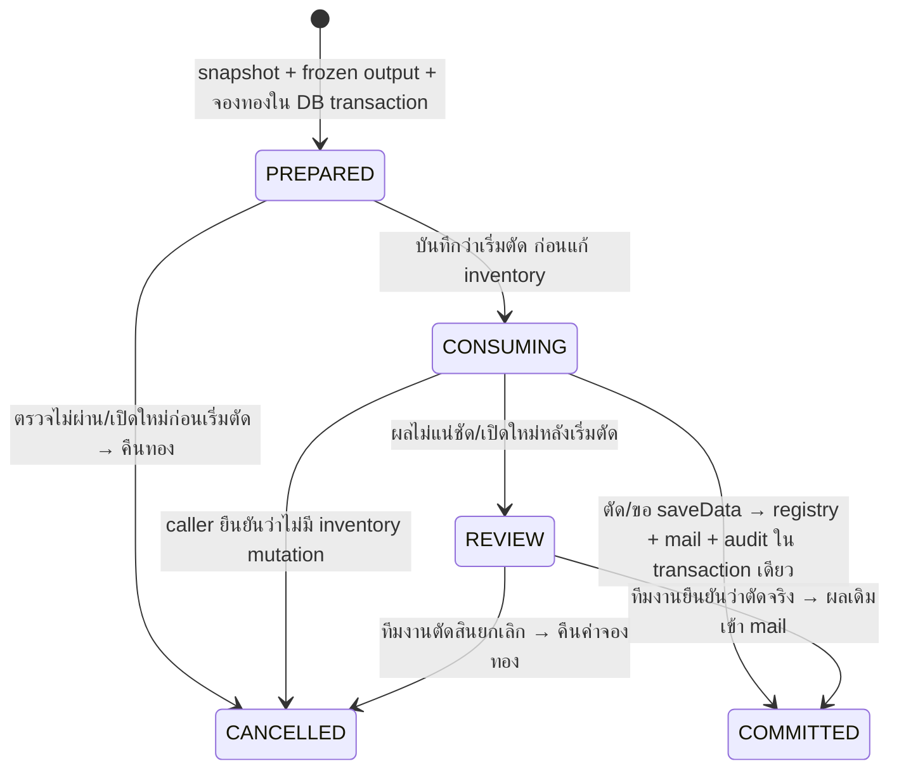

# Core Craft v0.5 — อุปกรณ์รูนและเคาน์เตอร์โรงตีเหล็ก

ฉบับ 5 ตุลาคม 2026: source/JAR build ได้และ unit tests ผ่าน แต่ **ยังไม่ได้ทดสอบใน Minecraft runtime จริง**
ใช้แผน [SERVER-SYSTEMS §7](../output/lobby-concept/SERVER-SYSTEMS-PLAN-th.md) และ
[INTERIOR โซน 07](../output/lobby-concept/INTERIOR-AND-MAP-PLAN-th.md) เป็นบริบท
รุ่นนี้คราฟต์ Core template จากวัตถุดิบ vanilla ธรรมดาและ `gold.wallet` ครั้งละหนึ่งชิ้น

## 1. เส้นทางผู้เล่น

ยืนใกล้ช่าง `craft.main` → คลิก NPC หรือ `/craft` หรือ `/menu` → ช่างคราฟต์อุปกรณ์รูน
เมนู 54 ช่องแสดงสูตร → เลือกสูตร → ดูวัตถุดิบทั้งหมด จำนวนที่มี/ต้องใช้/ขาด ราคา ผลลัพธ์และโควตาวันนี้ → ยืนยัน
ตัวเลขวัตถุดิบเป็นภาพ ณ ตอนเปิด/วาดหน้า preview; ก่อนตัดของบริการตรวจ inventory จริงอีกครั้ง
การเลือกสูตรและเปิด preview ยังไม่หักเงินหรือวัตถุดิบ

ยืนยันสำเร็จแล้วผลคราฟต์ **รอรับใน `/mail`** แม้กระเป๋ามีช่องว่าง; ไม่ตกพื้นและไม่แจกจากไอคอนเมนู
ผลลัพธ์มี UUID serial ใหม่, template ID/version ใน PDC และ owner ในทะเบียน Core
ทะเบียนกับจดหมายถูกสร้างพร้อมกันใน DB transaction เดียว ตอน commit ผลคราฟต์
เงินทองที่ฝากและเงินแดงไม่ถูกใช้; ไม่มีปุ่ม batch สำหรับอุปกรณ์ serial ในรุ่นนี้

| สูตรเริ่มต้น | วัตถุดิบธรรมดา | ค่าทองในกระเป๋า | โควตาต่อวันไทย | ผลลัพธ์หนึ่งชิ้น |
|---|---|---:|---:|---|
| `starter_runeblade` | IRON_INGOT 12 + LAPIS_LAZULI 4 + STICK 2 | 200 | 3 | Core `starter_runeblade` v1 / IRON_SWORD |
| `moonstone_pickaxe` | IRON_INGOT 16 + LAPIS_LAZULI 8 + STICK 4 | 300 | 2 | Core `moonstone_pickaxe` v1 / IRON_PICKAXE |
| `sentinel_chestplate` | IRON_INGOT 24 + LAPIS_LAZULI 12 + LEATHER 8 | 400 | 2 | Core `sentinel_chestplate` v1 / IRON_CHESTPLATE |

ตัวเลขเหล่านี้เป็นค่าเริ่มต้นสำหรับทดลองเศรษฐกิจของลูม่า ไม่ได้อ้างว่าเป็นค่าต้นฉบับในคลิป
ชื่อ/lore เป็นแฟนตาซี แต่ค่าพลัง/ความทนทานยังเป็น vanilla ของ material; ไม่มี stat RPG, bonus, ตีบวก หรือ animation item ใหม่จากระบบคราฟต์นี้
หลังรับ mail และใช้จนเสีย durability สามารถซ่อมผ่าน `/repair` เมื่อผ่าน identity/owner/version policy เดิม
ดู [คู่มือซ่อม](REPAIR-th.md); รุ่นนี้ยังไม่มีบริการโอน owner สำหรับการขายหรือส่งต่อ Core gear

## 2. ใบงานสร้างเคาน์เตอร์และ NPC


ภาพเป็น concept; โลกเมืองและจุดบริการจริงยังไม่ได้สร้างหรือเซ็นรับงาน
อาคาร 31 × 25 ใช้ local `u` เพิ่มไปตะวันออก/+X และ `v` เพิ่มไปใต้/+Z ตามแปลนเดิม
ให้ `(X0,Z0)` เป็นมุม local origin ที่ทีม build กำหนด แล้วแปลงด้วย `X=X0+u, Z=Z0+v`; ตรวจ Y ที่พื้นเดินจริง

| จุด | ตำแหน่งและสิ่งที่ต้องสร้าง |
|---|---|
| เคาน์เตอร์คราฟต์ | u=2..9, v=8..9 สูง 1 บล็อก; stone/spruce/blackstone และช่องมองเห็นตัวช่าง |
| ช่างคราฟต์ | เสนอ u=5.5, v=10.5 บนพื้นหลังเคาน์เตอร์; ใช้ NPC หนึ่งตัวสำหรับ action `craft.main` |
| จุดยืนผู้เล่น | u=5.5, v=6.5 พื้นราบ ช่องหัว ≥3 บล็อก; ระยะ NPC 4 บล็อก |
| ทิศ NPC | มองไปทางเหนือ/−Z (v ลด), yaw=180, pitch=0; ให้หันเข้าผู้เล่นหน้าเคาน์เตอร์ |
| ทางเข้า | u=13..17, v=1..6; เชื่อมทางเดินซ้ายกว้าง ≥3 บล็อก ไม่ปิดด้วย props |
| เคาน์เตอร์กลาง | u=11..19, v=8..9 สงวนสำหรับ upgrade; ป้าย “กำลังเตรียมระบบ” จนมีระบบจริง |
| เคาน์เตอร์ขวา | u=22..28, v=8..9 ใช้ `repair.main`; อย่าผูก action ของช่างคราฟต์แทนช่างซ่อม |
| ป้ายหน้าเคาน์เตอร์ | “คราฟต์อุปกรณ์รูน · ดูวัตถุดิบและค่าทอง · รับผลใน /mail · /craft” |
| ชั้นวัตถุดิบ | u=12..19, v=17..22; barrels ปิดสิทธิ์หยิบ, iron/lapis ตัวอย่างและหนังตกแต่ง |
| เตาหลอม | u=2..9, v=17..22; ลาวาปิด glass/iron bars ไม่มีช่องให้ตก/ตัก bucket |
| อุปกรณ์โชว์ | u=22..28, v=17..22 ใช้ display ที่หยิบไม่ได้ 2–3 ชิ้น; ไม่สำเนา serial ของผู้เล่นมาโชว์ |
| แสง/เสียง | โคมใต้คาน, โซ่ 2 เส้น, ควันปล่อง 1 จุด; คุม particle/เสียงไม่ให้วนทุก tick |

หากหมุนอาคาร ต้องหมุนทั้งพิกัดและ yaw: 0=ใต้/+Z, 90=ตะวันตก/−X, 180=เหนือ/−Z, −90=ตะวันออก/+X
Core Villager ใช้ yaw ของแอดมิน ณ ตอน spawn; ดู F3 ก่อนสั่ง

```text
# ยืนบนจุด NPC หลังเคาน์เตอร์และหันเหนือก่อนใช้คำสั่ง
/fa npc spawn craft.main ช่างคราฟต์รูน
/fa npc list
/fa doctor

# หากใช้ Citizens: วาง NPC ด้วย Citizens, ปรับตำแหน่ง/ทิศให้ตรง แล้วมองไปที่ตัว NPC
/fa npc bind craft.main
```

เลือก Core NPC หรือ Citizens อย่างใดอย่างหนึ่งสำหรับเคาน์เตอร์เดียวกัน ไม่วางตัวคลิกซ้อนกัน
Citizens ที่ย้ายตำแหน่งหลัง bind ต้อง bind ใหม่ให้ anchor ตรงตัว NPC และทดสอบระยะอีกครั้ง
`/fa npc anchor craft.main` ใช้เมื่อทีมงานต้องการจุดบริการแบบ anchor ไม่มีตัว NPC

model pilot `npc_rune_smith` และภาพอ้างอิงอยู่ใน [Asset Gallery](../output/lobby-concept/ASSET-GALLERY-th.md)
ใช้ idle/greet/ท่างานเป็นงานภาพใน phase model integration; การ bind นี้ยังไม่ได้ติดตั้ง ModelEngine/MythicMobs animation runtime
ของคราฟต์ทั้งสามชิ้นยังเป็น vanilla material + Core identity; ยังไม่มี resource-pack/model binding ใน JAR นี้
หากทำภาพ/model เพิ่ม ให้บันทึก template/material/version, scale, pivot, front direction และ animation manifest
ก่อนเชื่อม provider เพื่อรักษาตัวตนเดิม ไม่เปลี่ยน lore/component ของ template v1 ที่ออกไปแล้วโดยเงียบ ๆ

## 3. สูตรและกติกาวัตถุดิบ

ไฟล์ [crafting.yml](src/main/resources/crafting.yml) คือสูตร ส่วน [items.yml](src/main/resources/items.yml) คือแม่แบบผลลัพธ์

```yaml
enabled: true
recipes:
  starter_runeblade:
    enabled: true
    version: 1
    name: ดาบรูนผู้เริ่มต้น
    icon: IRON_SWORD
    daily-limit: 3
    gold-cost: 200
    inputs:
      IRON_INGOT: 12
      LAPIS_LAZULI: 4
      STICK: 2
    output:
      template: starter_runeblade
      version: 1
```

- Recipe ID เป็น a–z/0–9/_ ยาว 1–48; name ธรรมดา 1–80 ตัว; version เป็นจำนวนเต็ม 1–1,000,000
- `daily-limit` 1–1,000; `gold-cost` เป็นจำนวนเต็ม 0 ถึง `economy.max-transaction`; ราคา 0 ยังต้องมีวัตถุดิบ
- มี input 1–8 material ไม่ซ้ำ จำนวนต่อ material 1–2,304; อ่านเฉพาะ storage 36 ช่อง ไม่ใช้เกราะ/มือรอง
- ใช้เฉพาะ ItemStack ที่ไม่มี ItemMeta; ของชื่อพิเศษ/enchant/PDC/model/lore ไม่ถูกนับหรือถูกตัด แม้ material เดียวกัน
- Output หนึ่ง template ต้องมีจริง, `serialized: true` และ `output.version` ต้องเท่ากับ version ใน items.yml
- สูตรผิดปิดเฉพาะสูตรนั้นและขึ้นใน `/fa doctor`; ไม่มีสูตรที่ใช้ได้หรือ `enabled: false` → ปิดบริการ
- ปิด player saving/อ่าน bridge ไม่ได้ → ปิดทั้ง craft และ exchange; ไม่เริ่มจองเงิน
- โควตาตามวัน 00:00 Asia/Bangkok รวมทุก version ของ Recipe ID เดิม; PREPARED/CONSUMING/REVIEW/COMMITTED นับโควตา, CANCELLED ไม่นับ
- สูตร craft กับ exchange แยก quota namespace แม้ใช้ ID เดียวกัน แต่รายการ active/REVIEW ของผู้เล่นบล็อกทั้งสองบริการจนตัดสิน

เพิ่ม recipe version เมื่อเปลี่ยนสูตร/ราคา; เปลี่ยน template เป็น ID ใหม่เมื่อเปลี่ยนตัวตน/material/lore ที่มีผลต่อ policy ของชิ้นเก่า
Version ของ recipe และ output template เป็นคนละค่า และไม่ต้องเท่ากัน
รายการที่จองไปแล้วเก็บ bytes ของผลลัพธ์จริงพร้อม serial/version/ราคาไว้ ไม่อ่าน config ใหม่ระหว่าง recovery
ไม่มี hot reload สำหรับสูตรในรุ่นนี้; แก้ไฟล์แล้วหยุด/เปิดเซิร์ฟตามขั้นตอน

## 4. สิทธิ์และระยะบริการ

| Node | ค่าเริ่มต้น | หน้าที่ |
|---|---|---|
| `fantasy.craft.use` | ผ่าน `fantasy.player` | เปิดและยืนยันคราฟต์ |
| `fantasy.craft.remote` | false | ใช้จากทุกที่; ราคา วัตถุดิบและ quota เหมือนเดิม |
| `fantasyadmin.view` | OP | ดู doctor/review |
| `fantasyadmin.craft.resolve` | OP | ตัดสินรายการค้างพร้อมเหตุผลและยืนยัน |

ระยะมาตรฐาน 6 บล็อกในโลกเดียวกัน วัด 3D จาก anchor `craft.main` ตาม `station.radius`
ตรวจสิทธิ์และระยะตอนเริ่มและก่อนตัด inventory แม้เมนูเปิดจาก NPC ได้แล้ว
เดินออก/เปลี่ยน inventory/ปิดหน้าต่าง/ตาย/ถอนสิทธิ์ก่อนเริ่มตัด → ยกเลิกพร้อมคืนค่าจองถ้ามี
เมื่อเริ่มตัดแล้ว การปิดหน้าเมนูไม่ใช่เหตุให้คืนเงินอัตโนมัติ

## 5. Journal และการกู้คืน

Schema v5 เพิ่ม `kind`/`gold_cost` ใน `exchange_operations` และ serial/template/version ใน `exchange_outputs`
ใช้ planner, snapshot และเมนูร่วมกับ exchange; ไม่เปลี่ยนของรางวัล vanilla ของ `/exchange` เป็น Core items



`<op>:charge` และ `<op>:refund` เป็น operation ID ของ ledger; ส่ง ID ซ้ำไม่หัก/คืนซ้ำ
คืนเงินโดยเพิ่มค่าจองกลับไปยังยอดปัจจุบัน ไม่เขียนทับยอดก่อนจอง จึงรักษาธุรกรรมที่เกิดระหว่างทาง
PREPARED หลังเปิดใหม่จะยกเลิก/คืนทอง; CONSUMING จะไป REVIEW และเก็บค่าจอง ไม่ auto-grant/refund
Serial ใน output ถูกกันซ้ำตั้งแต่จอง; ทะเบียน `MAILED` สร้างเมื่อส่งเข้า mail พร้อม owner/op ID เดียวกัน
หาก registry/mail/audit เขียนไม่ได้ การ commit ของ DB rollback ทั้งชุดและรายการต้องตรวจ; ไม่มีทะเบียนชิ้นที่ผลคราฟต์ยังไม่เข้าจดหมาย

```text
/fa craft review
/fa craft complete <op> <เหตุผล>   # เมื่อยืนยันว่าตัดวัตถุดิบจริงแล้ว: ส่งผลเดิมเข้า /mail เก็บค่าจอง
/fa craft cancel <op> <เหตุผล>     # คืนค่าจองทอง ไม่คืนวัตถุดิบให้อัตโนมัติ
/fa confirm <token>               # ผู้สั่งคนเดิม ภายใน 60 วิ
/fa audit <ผู้เล่น>
```

Review แสดงผู้เล่น recipe/version/วัน วัตถุดิบ ค่าจอง และผลลัพธ์/serial/template version ที่บันทึกไว้
ตรวจ playerdata, snapshot, ledger, log และ mail ก่อนเลือก complete/cancel; เหตุผลอย่างน้อย 3 ตัวอักษร
หากตัดวัตถุดิบจริงแต่จะ cancel ให้ตรวจ/ชดเชยวัตถุดิบแยกพร้อม audit ก่อน อย่าปล่อย quota แล้วให้คราฟต์ฟรีซ้ำ
Confirm ตรวจสิทธิ์อีกครั้งและเปลี่ยนเฉพาะ REVIEW ของชนิด craft; `/fa exchange` ตัดสิน craft ไม่ได้
หลัง COMMITTED แล้ว **รับ mail เป็นอีก workflow**: ถ้าค้าง CLAIMING ให้ใช้ `/fa mail review/release/void` แทน resolve craft

หากคืนเงินล้นยอดหรือเกินเพดานที่ลดลงภายหลัง DB transaction จะ rollback; startup recovery ผิดพลาดจะปิด Core
ห้ามลบ receipt หรือแก้ state ตรง ๆ เพื่อบังคับผ่าน ให้สำรองและตรวจ ledger ก่อนแก้สาเหตุ

## 6. อัปเกรดจาก v0.4 และเซิร์ฟเดิม

1. หยุดเซิร์ฟและสำรอง DB/WAL/SHM, playerdata, โลก, config และข้อมูล region เป็นชุดเดียว
2. เปลี่ยน JAR เป็น v0.5; ตรวจ Java 25/Paper candidate เดิมตาม [staging](../server/README-th.md)
3. Schema v4 → v5 migrate อัตโนมัติ; ไม่เปลี่ยน wallet/mail/repair/exchange rows เดิม
4. สร้าง crafting.yml เมื่อไม่มี แต่ **ไม่เขียนทับ items.yml/config ที่เคยแก้เอง**
5. สำหรับเซิร์ฟเดิมที่มีเพียง starter_runeblade: ดาบเปิดได้; อีกสองสูตรจะปิดและแจ้ง doctor จนเพิ่ม moonstone_pickaxe/sentinel_chestplate จากไฟล์ตัวอย่างใต้ `templates` ใน items.yml
6. Merge เฉพาะสอง template ใหม่หลังตรวจ ID ชนกับของเดิม; อย่าคัดลอกทับทั้งไฟล์ หากเลือกไม่ใช้ให้ตั้ง `enabled: false` ของสองสูตรนั้น
7. เปิดใหม่หลังแก้ไฟล์ ตรวจ doctor + ผูก NPC + ทำ checklist M ใน staging; ให้ staff_economy ได้ `fantasyadmin.craft.resolve` ตามชุด LuckPerms
8. การย้อน JAR v0.4 ต้องกู้ **backup schema v4 พร้อม playerdata/โลกชุดเดียวกัน**; รุ่นเก่าจะปฏิเสธ schema v5

SQLite เป็นทะเบียนเกม ส่วนเว็บยังใช้ PostgreSQL; รุ่นนี้ยังไม่มี payment queue หรือ API ส่งคำสั่งจากเว็บ

## 7. หลักฐานและข้อจำกัด

Build Java 25/Paper API ที่ล็อกไว้ผ่าน; unit tests Core ทั้งหมด **76 กรณีผ่าน** (58 เดิม + 18 Craft เพิ่ม)
Craft tests ครอบคลุม charge/commit once, funds/limit, refund รักษายอดปัจจุบัน, concurrent 20 confirmations ได้หนึ่ง reservation,
quota/namespace, startup quarantine, review recovery, serial conflict, registry/audit failure rollback, immutable payload และ synthetic migration v4→v5
YAML/ข้อความตรวจ parse ได้ และตรวจลิงก์เอกสาร/asset แยกจาก tests ของธุรกรรม

การแก้ inventory/playerdata กับ SQLite **เป็นคนละระบบ**; `Player.saveData()` คืน void และอาจมี disk error ใน log
จึงยังไม่รับรอง exactly-once ข้าม disk failure/การกู้ backup ไม่ตรงชุด และยังไม่มี anti-dupe engine ครอบทั้งเซิร์ฟ
เมื่อผลไม่แน่ชัดให้ REVIEW; ห้ามแจกซ้ำหรือคืนวัตถุดิบจากการเดา
การเชื่อม provider/model, GUI จริง, native crafting guard, การคลิก NPC, client ViaVersion และ MSPT ต้องพิสูจน์บนเกมจริง
ตรวจตาม [server/README-th.md หมวด M](../server/README-th.md) ก่อนเปิดให้ผู้เล่น
