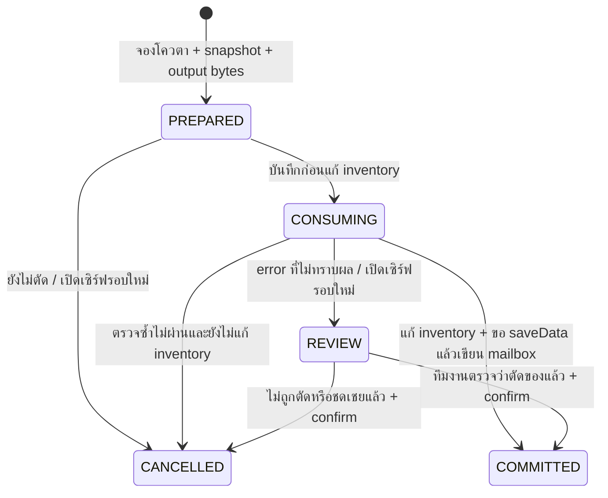

# QuestExchange v0.3 — คู่มือใช้งาน ตั้งสูตร และกู้รายการค้าง

ส่งมอบ 5 ตุลาคม 2026: source + JAR build ได้, unit tests ผ่าน; **ยังไม่ได้ทดสอบบน Minecraft runtime จริง**
นี่คือช่วงแรกของ [CASUAL-SURVIVAL §7](../output/lobby-concept/CASUAL-SURVIVAL-SYSTEMS-th.md)
ใช้สูตร vanilla ทดลองก่อนต่อ ItemAdapter และระบบ coupon ที่นำไปใช้งานได้จริง

## 1. ผู้เล่นใช้อย่างไร

1. เปิด `/exchange` หรือคลิก “กระดานแลกของ” ใน `/menu` หรือ NPC action `quest.exchange`
2. เลือกสูตร ระบบแสดงวัตถุดิบ รางวัล และโควตาของวันนี้
3. ปรับจำนวน 1–16 รอบ ดูยอดรวมในหน้ารายละเอียด แล้วกด “ยืนยันแลกตามรายละเอียด”
4. ระบบจอง operation ID พร้อมเก็บ slot ก่อน/หลังและรางวัลในฐานข้อมูล ก่อนเริ่มตัดของ
5. เมื่อบันทึกรางวัลสำเร็จ จะบอก operation ID และให้ไปรับรางวัลใน `/mail`
6. กระเป๋าเต็มก็แลกได้เมื่อวัตถุดิบครบ เพราะรางวัลอยู่ในกล่อง ไม่ตกพื้น; เมื่อมีพื้นที่จึงรับผ่าน `/mail`

ปิดหน้าต่าง/ออกเกม/ตาย/ถูกถอนสิทธิ์/วัตถุดิบเปลี่ยน **ก่อนเริ่มตัดจริง** จะยกเลิกและคืนโควตา
หลังเริ่มตัด ระบบต้องบันทึกผลหรือพักตรวจ การปิดเมนูตอนนี้ไม่ใช่คำสั่งคืนของ
ขณะทำงานปุ่มเมนูไม่ตอบสนอง และหนึ่ง UUID มีรายการ PREPARED/CONSUMING/REVIEW ได้เพียงหนึ่งรายการ
รายการ REVIEW จะล็อกการแลกทุกสูตรของ UUID นั้นจนทีมงานตัดสิน แม้เปลี่ยนวันแล้ว

## 2. สูตรที่เปิดในรุ่นนี้

| ID / ชื่อ | วัตถุดิบต่อรอบ | รางวัลต่อรอบ | โควตารอบ/วัน |
|---|---|---|---|
| `food_bundle` เสบียงนักเดินทาง | WHEAT 32 | BREAD 8 | 16 |
| `garden_lamp` โคมสวนแสงจันทร์ | TORCH 16 + IRON_INGOT 4 | LANTERN 2 | 16 |
| `starter_tool` เครื่องมือนักสำรวจ | IRON_INGOT 6 + STICK 4 | IRON_PICKAXE 1 | 4 |

สูตรทดลองนี้ไม่ใช่การยืนยันว่าตัวเลขตรงกับคลิปต้นฉบับ ต้องปรับ economy balance ก่อนเปิด public
`repair_credit`, `paint_palette`, `wardrobe_token` ยังไม่เปิด เพราะยังไม่มีระบบที่ใช้ coupon เหล่านี้จริง
ไม่มีการแจกของที่ใส่ชื่อ/lore แล้วอ้างว่าเป็น custom coupon ของระบบ

ตรวจเฉพาะ **storage 36 ช่อง** ไม่ใช้เกราะ มือรอง cursor หรือไอคอนในเมนู
ไอเทมที่ `hasItemMeta()` เป็น true จะไม่ถูกใช้ แม้ material ตรงกัน: ชื่อ, lore, enchant, damage, PDC, model และ component พิเศษ
จำนวนไม่ครบแม้หนึ่งวัตถุดิบ → ไม่ตัดอะไร; ของธรรมดาหลาย stack รวมกันได้
vanilla stack ไม่มี metadata ไม่สามารถระบุที่มา/เจ้าของได้ รุ่นนี้ยังไม่มีระบบพิสูจน์แหล่งที่มาของ vanilla item

## 3. ตั้งค่าและสิทธิ์

ไฟล์อยู่ที่ `plugins/FantasyCore/exchanges.yml` สร้างเมื่อเปิด v0.3 ครั้งแรก ถ้ามีอยู่แล้วจะไม่เขียนทับ
แก้ไฟล์แล้ว **restart** ห้ามใช้ `/reload` เพราะมี callback และ journal ที่กำลังทำงาน
ตัวอย่างเพิ่มสูตรใหม่:

```yaml
recipes:
  explorers_torch:
    enabled: true
    version: 1
    name: 'แสงส่องทาง'
    icon: TORCH
    daily-limit: 16
    inputs:
      COAL: 4
      STICK: 4
    outputs:
      TORCH: 16
```

รวมตัวอย่างเข้ากับ `recipes` เดิม อย่าสร้างหัวข้อ `recipes` ซ้ำ
ID เป็น a–z/0–9/_ ยาว 1–48 ตัว, `version` จำนวนเต็ม 1–1,000,000, `daily-limit` 1–1000
แต่ละสูตรมี inputs/outputs อย่างละ 1–8 material ที่เป็น item และไม่ใช่ AIR; material ที่ normalize แล้วซ้ำถูกปฏิเสธ
inputs แต่ละชนิดจำนวน 1–2304, outputs แต่ละชนิด 1–max stack ของ material นั้น
รางวัล batch จะถูกแยกเป็น stack ที่ถูกต้องก่อน serialize โดยมีได้ไม่เกิน 128 stack ต่อ operation
สูตรผิดจะปิดเฉพาะสูตรนั้น พร้อม log และ `/fa doctor`; ถ้าไม่มีสูตรใช้ได้ เมนูจะบอกว่ายังไม่เปิด
ชื่อสูตรเป็นข้อความธรรมดา ป้องกันชื่อที่มี MiniMessage tag กลายเป็น formatting/injection

เปลี่ยนวัตถุดิบหรือรางวัลต้องเพิ่ม `version`; ห้ามเปลี่ยน ID เพื่อเลี่ยง quota
โควตารวม batch ทุก version ของ ID เดียวกัน ต่อ UUID ต่อวันที่ยืนยันตาม **Asia/Bangkok**
PREPARED/CONSUMING/REVIEW/COMMITTED นับโควตา; CANCELLED ไม่ถูกนับ
รายการที่ยืนยันก่อนเที่ยงคืนใช้โควตาวันที่จอง แม้ DB commit หลังเที่ยงคืน
เมนูแสดงยอดที่โหลดล่าสุด; DB เป็นผู้ตัดสินจริง เมื่อข้ามวันให้เปิด `/exchange` ใหม่
รายการที่ค้างใช้รางวัลที่ serialize เก็บไว้ตอนยืนยัน ไม่ใช้สูตร/config ปัจจุบันเมื่อ recovery

| สิทธิ์ | ค่าเริ่มต้น | ใช้งาน |
|---|---|---|
| `fantasy.exchange` | ผ่าน `fantasy.player` ทุกคน | เปิดและยืนยันแลก |
| `fantasy.mail` | ผ่าน `fantasy.player` ทุกคน | รับรางวัลในกล่อง |
| `fantasyadmin.view` | OP | `/fa doctor`, `/fa exchange review` |
| `fantasyadmin.exchange.resolve` + `.view` | OP | ตัดสิน REVIEW + เหตุผล + confirm |

`server/setup/luckperms-setup.txt` เพิ่มสิทธิ์ resolve เฉพาะ `staff_economy` (owner รับผ่าน parent)
builder/content/observer ไม่ได้สิทธิ์ resolve ผ่านชุดตั้งต้นนี้
ผูก Citizens: มอง NPC แล้ว `/fa npc bind quest.exchange`; หรือวาง Villager ทดสอบด้วย `/fa npc spawn quest.exchange นักแลกของ`
เมนู/NPC/คำสั่งทั้งหมดเรียกบริการเดียวกันและตรวจสิทธิ์ซ้ำก่อนตัด

## 4. Journal และขอบเขต transaction



`exchange_operations` เก็บ UUID, recipe ID/version, batch, period, state, input summary, slot_snapshot, timestamps
`exchange_outputs` เก็บ ordinal, label, item_data และ mail_id ที่ส่งจริง
slot_snapshot format v1: int version=1, int count, แล้วแต่ละ slot เป็น int index / int beforeLength + bytes / int afterLength + bytes
afterLength=0 หมายถึงช่องว่าง; ItemStack bytes ต้องอ่านด้วย Paper API รุ่นที่รองรับ ห้ามเอา hex มาแจกของตรง ๆ

state COMMITTED + จดหมายทุกชิ้น + mail_id + audit ถูก commit ใน **SQLite transaction เดียว**
หาก insert mail หรือ audit ล้มเหลว จะ rollback ทั้งชุด และไม่เปิดให้ทำ operation เดิมซ้ำ
normal complete และ staff resolve มีการเปลี่ยนสถานะแบบมีเงื่อนไข จึงไม่ enqueue รางวัลเดิมซ้ำ
ตาราง Exchange เพิ่มใน schema v3; Core v0.4 ใช้ schema v4 เพิ่มตารางซ่อม โดย flow Exchange เดิมยังอยู่
PostgreSQL ฝั่งเว็บยังไม่ได้เขียน wallet/แลกของจากเว็บโดยตรง

**player inventory และ SQLite ไม่ได้เป็น transaction เดียวกัน**
เรียก `Player.saveData()` บน main thread หลังตัดของ ก่อน commit รางวัล และก่อนปิดสถานะจดหมายที่รับ
ถ้า `players.disable-saving: true` ใน spigot.yml จะปิดการแลกและไม่ให้รับจดหมาย
การอ่าน flag ใช้ Spigot config bridge ที่ยังมีใน Paper 26.2 และถูก mark removal (typed ServerConfiguration ยังไม่ expose flag นี้)
แยกใน `PlayerDataSaving` จุดเดียว; ถ้า API อ่านไม่ได้จะปิดการแลก/รับของและแจ้งใน doctor ต้องแก้ bridge ก่อนเปลี่ยน backend รุ่นที่ถอด API นี้
แต่ API saveData คืนค่า void และ storage ชั้นล่างอาจ log เมื่อเขียนไฟล์ล้มเหลวโดยไม่โยน exceptionกลับมา
จึงยังรับรอง exactly-once กรณี disk failure, restore playerdata แยกจาก DB หรือปลั๊กอินอื่นแก้ inventory ไม่ได้
หลักฐาน: [CraftPlayer.saveData](https://github.com/PaperMC/Paper/blob/main/paper-server/src/main/java/org/bukkit/craftbukkit/entity/CraftPlayer.java),
[PlayerDataStorage save/error handling](https://github.com/PaperMC/Paper/blob/main/paper-server/patches/sources/net/minecraft/world/level/storage/PlayerDataStorage.java.patch)
อ้างอิง source สาขา main ณ วันที่ตรวจ; ยังต้องตรวจ implementation และจำลอง disk failure บน build ที่เลือกจริง

ต้องเฝ้า log `Failed to save player data`, พื้นที่ดิสก์และ MSPT; เมื่อ storage ผิดปกติหยุดบริการและตรวจ receipt/backup ก่อนเปิดใหม่
รายการค้าง CONSUMING ไม่คืนหรือแจกอัตโนมัติ; สถานะ REVIEW เก็บโควตาและบล็อกการแลกใหม่
การรับจดหมายที่ค้าง CLAIMING ใช้ระบบ `/fa mail review` แยกกัน อย่าใช้ exchange resolve แก้รายการ mail

## 5. ทีมงานตัดสินรายการค้าง

1. ใช้ `/fa doctor` ดูจำนวนค้าง และ `/fa exchange review` ดู 20 รายการแรกพร้อม op/UUID/สูตร/version/batch/วัน/วัตถุดิบ
2. หยุดให้เจ้าของรายการย้ายของระหว่างตรวจ เก็บ log และ backup โดยไม่แก้ DB; เทียบ slot_snapshot, playerdata/inventory, mail และประวัติกิจกรรม
3. **ยืนยันว่าตัดวัตถุดิบแล้วและยังไม่มีรางวัลของ operation นี้**: `/fa exchange complete <op> <เหตุผล>`
4. **ยืนยันว่าไม่เคยตัด หรือชดเชยวัตถุดิบแล้วและต้องปิดรายการ**: `/fa exchange cancel <op> <เหตุผล>`
5. อ่าน preview สูตร/จำนวน/ผลที่จะเกิด แล้ว `/fa confirm <รหัส>` ภายใน 60 วินาทีด้วยผู้สั่งคนเดิม
6. ตรวจ `/mail`, quota และ audit หลังทำ; confirm ซ้ำหรือ op ไม่ใช่ REVIEW จะไม่มีการเปลี่ยนแปลง

`complete` ส่ง output ที่เก็บไว้เข้า mail และคง quota; `cancel` คืน quota แต่ **ไม่คืนวัตถุดิบเอง**
ต้องใส่เหตุผลอย่างน้อย 3 ตัวอักษร, ตรวจสิทธิ์ resolve ซ้ำตอน confirm, CAS state และ audit อยู่ใน transaction เดียวกัน
หากหลักฐานไม่พอให้คง REVIEW ไว้ อย่าเดาจากจำนวนของปัจจุบันเพียงอย่างเดียว เพราะผู้เล่นอาจย้าย/ใช้ของไปแล้ว
อย่าแก้ state ด้วย SQL, ลบ journal หรือ replay operation โดยไม่ตรวจสาเหตุ

## 6. อัปเกรด สำรอง และทดสอบ

หยุดเซิร์ฟ → สำรอง `plugins/FantasyCore` + playerdata/world + WorldGuard regions เป็นชุดเดียว → เปลี่ยน JAR → เปิดใหม่
Core v0.4 migrate ฐานข้อมูลเดิมเป็น schema v4 อัตโนมัติ; unit test พิสูจน์ synthetic DB v2 ไป schema ปัจจุบันว่าเงินและจดหมายเดิมยังอยู่
ห้าม downgrade JAR อย่างเดียวหลัง migration; rollback ต้องใช้ backup ทั้งชุดที่ตรงเวลากัน
ไม่ restore playerdata เก่าทับขณะ DB ยังถือ COMMITTED ใหม่ เพราะทำให้วัตถุดิบกลับมาแต่รางวัลยังอยู่

ทำตาม [staging checklist หมวด K](../server/README-th.md) ทั้ง client 26.2 และแถว ★ กับ 1.16.5
รวมเมนู/ปุ่มจำนวน, inventory full, ของมี metadata, double click, สิทธิ์, เปลี่ยนหน้าต่าง, ข้ามวัน,
restart/terminate แต่ละ boundary, resolve, migration และ MSPT ขณะแลกพร้อมกัน
unit tests ใช้ byte fixtures สำหรับ DB จึงยังไม่พิสูจน์ ItemStack serialization, GUI หรือ saveData ในเกมจริง

ลำดับถัดไป: ItemAdapter ที่พิสูจน์ identity/serial → recipe custom → Repair → coupons ที่นำไปใช้ได้จริง
ค่อยเพิ่มรูป/model และขยายสูตรหลังผ่าน runtime tests ของเส้นทางตัดของและส่งรางวัล
