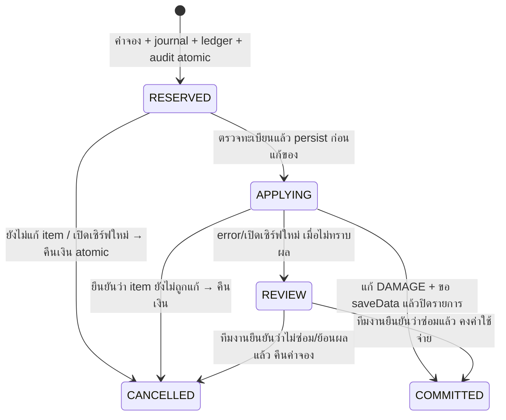

# ItemAdapter และ Repair v0.4 — โรงตีเหล็กของลูม่า

ฉบับ 5 ตุลาคม 2026: build + unit tests ผ่าน แต่ **ยังไม่ได้ทดสอบ Minecraft runtime จริง**
Core ปัจจุบัน v0.6/schema v5; flow ซ่อมของ v0.4 ยังอยู่ และเพิ่ม [ช่างคราฟต์](CRAFT-th.md) ที่เคาน์เตอร์ซ้าย
ตาม [SERVER-SYSTEMS §7 คราฟต์และซ่อม](../output/lobby-concept/SERVER-SYSTEMS-PLAN-th.md) และ
[ผังภายในโซน 07](../output/lobby-concept/INTERIOR-AND-MAP-PLAN-th.md)

อ่าน [แม่แบบย้อนหลัง v0.6](ENCHANTS-th.md): ซ่อม v1/v2 ตาม revision จริง โดยคง enchant/serial และไม่เพิ่มพลังจากรุ่นใหม่

## 1. ใช้งานและวางสถานี

ผู้เล่นถืออุปกรณ์ 1 ชิ้นในมือหลัก ยืนใกล้ช่างซ่อม → `/repair` หรือ `/menu` → ช่างซ่อมอุปกรณ์
หน้าเมนูแสดง material, provider, ความทนทานก่อน/หลัง, ราคา และทองที่พกขณะแสดง
ตรวจรายละเอียดแล้วกด “ยืนยันราคาและซ่อม” ภายใน 60 วินาที; ไม่ต้องลากของใส่เมนู
ก่อนจองเงินและก่อนแก้ item จะตรวจ slot/ของ/สิทธิ์/ระยะ/หน้าต่างซ้ำ
เลื่อน hotbar, เปลี่ยนของ, เพิ่ม damage, ตาย, ออกเกม, ปิดหน้าต่าง หรือออกนอกระยะก่อนเริ่มแก้ → ยกเลิกและคืนเงินที่จอง
เมื่อซ่อมสำเร็จยังเป็นชิ้นเดิมใน slot เดิม ไม่ส่งสำเนาเข้า mail และไม่มีของตกพื้น
ของเต็มความทนทานไม่มีรายการซ่อมและไม่คิดราคาใหม่

NPC ตั้งต้น:

```text
/fa npc spawn repair.main ช่างซ่อมรูน
```

สำหรับ Citizens ให้สร้าง NPC แล้วมอง NPC นั้นและใช้ `/fa npc bind repair.main`
หรือวาง anchor ณ จุดช่างด้วย `/fa npc anchor repair.main`
ระยะใช้ `stations.remote-radius` (ค่าเริ่มต้น 6 บล็อก) แบบ 3 มิติในโลกเดียวกัน
ระยะถูกตรวจอีกครั้งในบริการ แม้ NPC/คำสั่งเปิดเมนูได้แล้ว ไม่ให้เดินไปซ่อมฟรีจากนอกสถานี
Citizens ที่ผูกใช้พิกัดตอน bind; NPC งานระบบควรยืนประจำที่ ถ้าย้ายแล้วให้ bind/anchor ใหม่

## 2. ใบงานสร้างจุดซ่อมโซน 07


ภาพเป็น concept สำหรับงาน build ไม่ใช่ภาพยืนยันว่าโลกเมืองสร้างแล้ว
อาคาร 31 × 25 ใช้ระบบ local u/v ตามแปลนเดิม (u เพิ่มไปทางตะวันออก, v เพิ่มไปทางใต้ เมื่อวางอาคารตามแกน)

| จุด | ตำแหน่ง/งาน build |
|---|---|
| เคาน์เตอร์ซ่อม | u=22..28, v=8..9 สูง 1 บล็อก; เว้นช่องมองเห็นตัวช่างและป้าย |
| ตัวช่าง | จุดเสนอ (u=25.5, v=10.5) บนพื้นเดินหลังเคาน์เตอร์; ตรวจ Y จากพื้นโลกจริง |
| จุดผู้เล่น | (u=25.5, v=6.5), พื้นราบ ไม่ให้ติด fence/carpet/hopper |
| ทิศ NPC | มองไป v ลดลง (ทิศเหนือ) yaw=180, pitch=0; Core NPC ใช้ทิศของแอดมินตอน spawn |
| ป้าย | “ซ่อมอุปกรณ์ · ถือของในมือหลัก · ดูราคาก่อนยืนยัน · /repair” |
| props | anvil 2 จุด, grindstone 1 จุด, smithing table 1 จุด ตามแปลน; ทดสอบ native policy ก่อนเปิดให้กด |
| ทางเดิน | ทางเข้า u=13..17,v=1..6 เชื่อมมายืนหน้าเคาน์เตอร์ กว้างอย่างน้อย 3 บล็อก ช่องหัว ≥3 |
| เตาหลอม | u=2..9,v=17..22 ลาวาปิด glass/iron bars ไม่มีช่องตกหรือใช้ bucket ตัก |
| ตัวอย่างอุปกรณ์ | u=22..28,v=17..22 เพียง 2–3 ชิ้น เป็น display ที่หยิบไม่ได้ ไม่ใช้สำเนา serial จริงของผู้เล่น |

ถ้าหมุนอาคารให้หมุนตำแหน่งและ yaw พร้อมกัน: yaw 0=ใต้/+Z, 90=ตะวันตก/−X, 180=เหนือ/−Z, −90=ตะวันออก/+X
model pilot `npc_rune_smith` มีอยู่แล้ว ดู [โมเดลและภาพ](../output/lobby-concept/ASSET-GALLERY-th.md)
เมื่อเลือก MythicMobs/ModelEngine runtime ที่ผ่าน matrix แล้วค่อยผูก click กับ action เดียวกัน ไม่สร้าง model entity ซ้อน NPC Citizens/Core
รอบนี้ไม่มี adapter MythicMobs/ModelEngine เพิ่ม และยังไม่ได้วาง NPC ลงโลกจริง
ตรวจคลิกจาก 4 ทิศ ระยะขอบ 6 บล็อก, WorldGuard flags, collision, แสงและภาพใน client 1.16.5/26.2 ก่อนเซ็นรับงาน

## 3. ไอเทมที่รองรับจริง

`ItemAdapter` เป็นชั้นอ่าน/แก้ item ผ่าน API เดียวสำหรับ Repair ตอนนี้ ไม่มี provider ที่ยังไม่ติดตั้งแล้วทำปุ่มสำเร็จปลอม

| Provider | เกณฑ์รับ |
|---|---|
| vanilla | material มี MAX_DAMAGE, จำนวน 1, ไม่ unbreakable; components ตรงต้นแบบเมื่อไม่นับ DAMAGE/ENCHANTMENTS/CUSTOM_NAME/REPAIR_COST |
| Core | template ID/version/material ตรง items.yml ปัจจุบัน, serialized=true, UUID serial canonical, components ตรงแม่แบบโดยยกเว้นสี่ตัวข้างต้น |
| MMOItems / Nexo / ItemsAdder / custom component อื่น | ปฏิเสธจนมี adapter ของ provider นั้นและผ่านการทดสอบ |

vanilla ที่ enchant หรือเปลี่ยนชื่อผ่าน anvil ใช้ได้ แต่ lore/model/stats/attributes/custom-data ที่เปลี่ยนจากต้นแบบจะไม่ fallback เป็น vanilla
marker ของ Core ที่ผิดชนิดข้อมูล ขาด version หรือ serial ผิดรูปแบบก็ไม่ fallback เป็น vanilla
Core ต้องตรงทะเบียน DB: serial/template/version/owner UUID และ state DELIVERED หรือ MAILED
MAILED ต้องไม่มีจดหมาย PENDING/CLAIMING/REVIEW ของ issuance นั้นเหลืออยู่ ต้องรับของใน `/mail` จนปิดรายการก่อน
ตรวจซ้ำที่ preview, reserve และ beginApply; ถ้าทะเบียนเปลี่ยนก่อนเริ่มซ่อมจะคืนเงิน
serial ซ้ำใน inventory 41 ช่องของผู้เล่นหรือ stack เดียว amount>1 จะถูกปฏิเสธ
DB ยังบังคับ active repair หนึ่งรายการต่อ UUID และต่อ serial

owner ในทะเบียนใช้จำกัดผู้มีสิทธิ์ซ่อม Core ในรุ่นนี้ ยังไม่มี transfer owner, marketplace ownership, trade หรือการล็อก combat/drop ทั้งระบบ
ยังไม่ใช่ตัวตรวจ serial ทุก chest/offline player ทั่วเซิร์ฟ และไม่ใช่ระบบ anti-dupe ครบทั้งเซิร์ฟ
การแก้ template ต้องเพิ่ม version และวางแผนอัปไอเทมเก่า; รุ่นเก่าที่ไม่ตรง current template จะถูกปฏิเสธ ไม่แก้ให้ใหม่เอง

ซ่อมด้วย clone ของชิ้นจริงและ `setData(DAMAGE, 0)` แล้วตรวจว่าชิ้นก่อน/หลังตรงกันเมื่อยกเว้นเฉพาะ DAMAGE
จึงไม่สร้าง item จากชื่อ/lore หรือจาก recipe ใหม่ตอนซ่อม รักษา component ที่ adapter ยอมรับไว้ทั้งหมด
API Data Components ผูกกับ backend Paper 26.2 build 129; client 1.16.5 ใช้ ViaVersion/ViaBackwards ไม่ใช่การโหลด JAR บน backend 1.16.5
ดู [Paper Data Components](https://docs.papermc.io/paper/dev/data-component-api/) และต้องทดสอบ ItemStack จริงก่อนรับรอง metadata preservation

## 4. ราคาและสิทธิ์

ไฟล์ `plugins/FantasyCore/repair.yml` ถูกสร้างเมื่อยังไม่มี ไม่เขียนทับไฟล์ที่แก้แล้ว เปลี่ยนแล้ว restart ห้าม `/reload`

```yaml
enabled: true
pricing:
  base-gold: 50
  full-damage-gold: 450
```

สูตร: **base + ceil(full-damage × damage / max-damage)** ทองที่พก; ถ้า damage=0 ราคา=0 และไม่สร้างรายการ
ตัวอย่าง maxDamage=250: เสีย 1 → 52 ทอง, เสีย 100 → 230 ทอง, เสีย 249 → 499 ทอง
base เป็นจำนวนเต็ม 0–1,000,000,000, full-damage เป็น 1–1,000,000,000 และผลรวมต้องไม่เกิน economy max-transaction
ค่า config ผิดปิดบริการซ่อม แสดงใน doctor; เงินไม่พอ/ราคาเกินวงเงินไม่มี repair reservation ที่คิดเงิน
ตอนยืนยันอ่าน wallet ปัจจุบันใหม่ ไม่เชื่อ cache หรือราคาที่ client ส่ง; เงินฝากและเงินแดงไม่ถูกแตะ
ราคาทดลองนี้ไม่ใช่การยืนยันว่าทุกชิ้นในคลิปซ่อม 500 ทอง

| Permission | ค่าเริ่มต้น | งาน |
|---|---|---|
| `fantasy.repair.use` | ผ่าน fantasy.player | เมนู/NPC/คำสั่งซ่อม |
| `fantasy.repair.remote` | false | ซ่อมจากทุกที่ แต่ราคาและ identity checks เหมือนเดิม |
| `fantasyadmin.view` | OP | doctor / รายการ review |
| `fantasyadmin.repair.resolve` + `.view` | OP | ตัดสินค้าง + reason + confirm |

ชุด LuckPerms เพิ่ม resolve ให้ staff_economy; default ไม่ได้ remote และปิด essentials.repair/essentials.repair.all
ต้องใช้ non-OP ทดสอบจริง และตรวจ permission/aliases ของ utility repair อื่นทุกตัวที่เลือกเพิ่ม
NativeRepairListener ตรวจทั้ง Prepare result และตอนหยิบผล: vanilla ลด damage ผ่าน anvil/grindstone/2-item craft ไม่ได้เมื่อ enabled=true
Core markers ถูกปิด native anvil/grindstone/crafting ทั้งหมด (รวม rename/รวม enchant) จนมี adapter ที่รักษา identity ได้
ถ้าตั้ง enabled=false vanilla native repair กลับใช้ได้ แต่การเอา Core ไปผ่าน native ยังถูกปิดเพื่อรักษา serial
enchant table ของ vanilla/Core และ Mending ยังเป็นพฤติกรรม vanilla ที่อนุญาต; ไม่ได้บังคับว่าการคืน durability ทุกแบบต้องใช้ทอง
listener นี้ไม่สามารถควบคุมคำสั่งหรือการแก้ inventory โดยตรงจากปลั๊กอินอื่นที่ได้รับสิทธิ์เต็ม ต้องผ่าน staging integration ก่อนเพิ่ม provider/utility

## 5. Journal เงินและการกู้คืน

`repair_operations` เพิ่มใน SQLite schema v4 เก็บ provider/template/version/serial, material/slot/damage/max,
price, before_data, repaired_data, state และเวลา; bytes ของ item ใช้ Paper serialization



จองหัก `gold.wallet` ด้วย op `<id>:charge`; คืนด้วย `<id>:refund` และ state/audit ใน transaction เดียว
คืน “จำนวนค่าจอง” เพิ่มเข้า wallet ปัจจุบัน ไม่ย้อนยอดเงินทั้งหมดทับธุรกรรมอื่น
คืนหรือ complete ซ้ำไม่ทำซ้ำ; คืนจน balance overflow/DB write ไม่ได้ → rollback ทั้งเงิน/state คงรายการไว้ตรวจ
เปิดเซิร์ฟรอบใหม่ RESERVED คืนอัตโนมัติเพราะยังไม่เริ่มแก้ของ; APPLYING ย้าย REVIEW และไม่คืนเงินอัตโนมัติ
REVIEW บล็อกซ่อมใหม่ของ UUID/serial จนตัดสิน ไม่บล็อกทุกบริการของผู้เล่น

`/fa repair review` แสดง 20 รายการแรกพร้อม op/UUID/material/damage/ราคา/serial
ตรวจ snapshot กับ inventory/playerdata และประวัติเงินก่อน:

```text
/fa repair complete <op> <เหตุผล>  # ยืนยันว่าของซ่อมจริงแล้ว: คงค่าบริการ ไม่แก้หรือแจก item อีก
/fa repair cancel <op> <เหตุผล>    # ไม่ซ่อม หรือทีมงานย้อนผลซ่อมแล้ว: คืนเงิน ไม่เปลี่ยน item
/fa confirm <รหัส>                # ภายใน 60 วิ ผู้สั่งคนเดิม
```

เหตุผล ≥3 ตัวอักษร, ตรวจ permission ซ้ำตอน confirm, state เปลี่ยนแบบมีเงื่อนไข และ audit พร้อม operation ID
อย่า cancel รายการที่ซ่อมแล้วโดยไม่ย้อนผล เพราะจะกลายเป็นซ่อมฟรี; ถ้าหลักฐานไม่พอคง REVIEW ไว้
ไม่ใช้ snapshot แจกสำเนา item อัตโนมัติ และไม่แก้ state ด้วย SQL

inventory/playerdata กับ SQLite ยังเป็นคนละระบบ แม้เรียก saveData ก่อน complete ก็ไม่ได้ atomic กัน
ข้อจำกัด saveData คืน void, disk failure และ restore backup แยกชุดเหมือน [Exchange recovery](EXCHANGE-th.md)
PlayerDataSaving ปิดบริการเมื่อ players.disable-saving=true หรืออ่าน flag ผ่าน bridge ไม่ได้ ต้องเฝ้า disk/log/MSPT จริง
สำรองหลังหยุดเซิร์ฟพร้อม playerdata, โลก, WorldGuard และ DB ทั้งชุด; downgrade ต้องคืน backup ทั้งชุด ไม่ย้อน JAR อย่างเดียว

## 6. ผลตรวจและลำดับต่อไป

Core v0.4 build ผ่านด้วย Paper API ที่ตรึงไว้, unit tests **58 รายการผ่าน** (42 เดิม + 16 ใหม่)
ใหม่ครอบคลุม registry identity/owner/state, สูตรจำนวนเต็ม/overflow, charge/refund once, wallet bucket,
rollback เมื่อ journal เขียนไม่ได้, recovery, ค้าง review, invalidate registry ก่อน apply, Pending mail,
20 concurrent reservations จองได้ 1 ครั้ง, refund overflow และ migration v3→v4 รักษา exchange/mail/เงิน
unit tests เป็น logic/SQLite และ byte fixtures ไม่ได้ทดสอบ entity/GUI/DataComponents/native events หรือ saveData จริง
ทำ [staging checklist หมวด L](../server/README-th.md) ก่อนเปิด public

ลำดับถัดไปคือ provider adapter ของ item/model framework ที่เลือกจริง แล้วค่อยเปิด custom recipe/repair coupons,
ตามด้วย upgrade/skin ที่มี identity และ rollback policy; ยังไม่มี coupon จาก daily/exchange ในรุ่นนี้
