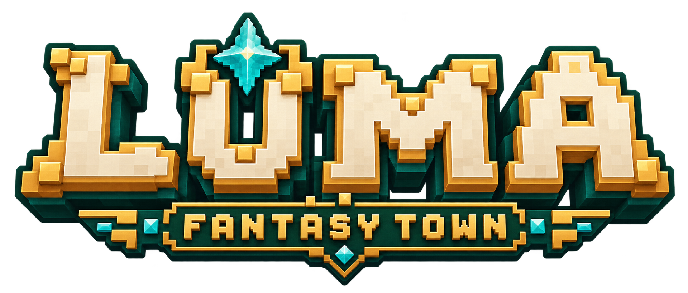
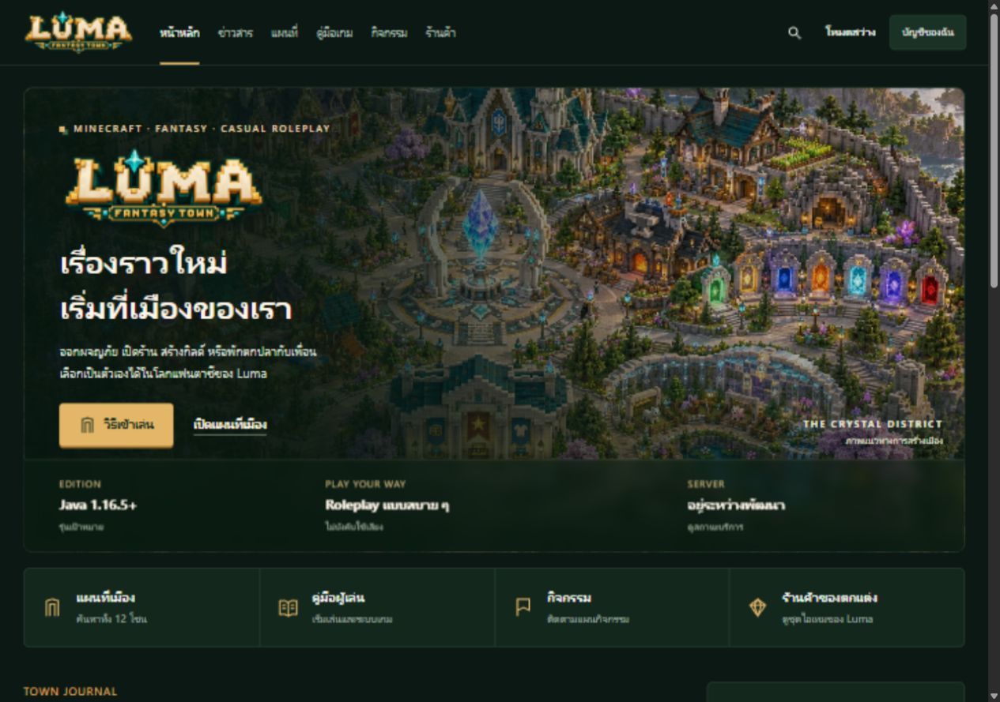

# Luma — โลโก้และสีประจำเมือง

ชื่อแนะนำ **Luma / ลูม่า** ออกเสียงสั้น จำง่าย เหมาะกับเมืองแฟนตาซีที่เล่น roleplay ได้โดยไม่บังคับจริงจัง
Repository ชื่อ Minecraft-Luna ตามที่เจ้าของกำหนด แบรนด์ในต้นแบบยังใช้ Luma

## แนวทางภาพ

ตัวอักษร voxel สีงาช้าง ขอบทอง ฐานเขียวหยกและคริสตัลฟ้า สร้างใหม่ด้วย image generation
ไฟล์ PNG พื้นหลังโปร่งใสอยู่ที่ [luma-logo.png](brand/luma-logo.png)
เว็บไซต์ใช้ WebP ที่บีบอัดเพื่อโหลดเร็วขึ้น โดยเก็บ PNG ต้นฉบับครบ

| หน้าที่ | สี | การใช้ |
|---|---|---|
| สีประจำเมือง | `#194D39` | ธีมเขียวหยก เสื้อบริการ กรอบตราเมือง |
| ทองอุ่น | `#DDA54A` | ขอบโลโก้ รูน ไอคอน จุดเน้น |
| ทองสำหรับปุ่มเว็บกลางคืน | `#E3B767` | ปุ่มหลักและข้อความเน้นบนพื้นเข้ม |
| พื้นเว็บกลางคืน | `#0C1813` | พื้นหลังหน้าและช่องว่าง |
| แผงกลางคืน | `#14271D` | บัญชี ข่าว และสถานะบริการ |
| งาช้าง | `#EDF4E9` | ข้อความบนพื้นเข้ม |
| ฟ้าคริสตัล | `#47C8D3` | คริสตัลและเวทมนตร์ในงานภาพ |

ฟ้าคริสตัลใช้ในงานภาพ ส่วนเว็บให้ทองเป็นตัวเน้นหลักเพื่อไม่แย่งสายตา
มีธีมกลางวันและตัวเลือกลดการเคลื่อนไหวที่บันทึกในเบราว์เซอร์

## เว็บไซต์รุ่นใหม่

ภาพเมือง Minecraft แบบเต็มสี หน้าแรกมีทางลัดบริการ ข่าว วิธีเริ่มเล่น และสถานะเซิร์ฟ
ใช้รูปทรงมุมสั้นและไอคอนเส้นเหลี่ยมเป็นภาษาของ UI ไม่ใช้ตัวอักษร pixel กับย่อหน้ายาวภาษาไทย
ตัวเลขข้อมูลจริงต้องมีแหล่งและเวลาอัปเดต ห้ามทำจำนวนผู้เล่นหรือยอดเงินให้ดูออนไลน์ทั้งที่ยังไม่มี API

## TAB และ scoreboard

ภาพ TAB เป็นแนวทางจัดวาง 4 คอลัมน์ โลโก้กลางบน rank สี แถบ ping และ footer
ชื่อผู้เล่น เงิน และฤดูกาลในภาพเป็นข้อมูลประกอบภาพ ไม่ใช่ผู้เล่นหรือยอดเงินจริง
เว็บในภาพใช้โดเมนสงวน `.example` ไม่ใช่โดเมนที่เปิดบริการ

ภาพ HUD ฉบับแรกใช้โลโก้สีทอง–ชมพูสำหรับทดลององค์ประกอบ
งาน production ต้องแทนด้วยโลโก้เขียวหยก–ทองฉบับล่าสุด ไม่ใช้สีชมพูเป็นสีหลักของเมือง
ข้อจำกัด native TAB/scoreboard และการทำ font glyph อยู่ใน [HUD-TAB-SCOREBOARD-SPEC-th.md](HUD-TAB-SCOREBOARD-SPEC-th.md)
ภาพกรอบใบไม้และคริสตัลไม่ได้ยืนยันว่า TAB plugin เพียงตัวเดียววาด overlay รอบจอได้

## ไฟล์ที่ต้องเตรียมก่อนใช้ในเกมจริง

- แยก logo glyph, rank glyph, coin, red currency, guild และฤดูกาลลง font atlas ที่ขนาด GUI จริง
- สร้าง server icon 64 × 64 ที่อ่านออกใน multiplayer list ไม่ย่อโลโก้ทั้งคำจนเล็กเกินไป
- ทดสอบ transparent edges, baseline, shadow และ GUI scale บน client 1.16.5 และรุ่นใหม่
- ยังไม่มี vector master, font atlas หรือ server icon ที่ผ่านการทดสอบเกมจริง
- ต้องตรวจชื่อ/โดเมนก่อนนำแบรนด์ไปจดทะเบียนหรือใช้เชิงพาณิชย์ ชื่อนี้เป็นข้อเสนอออกแบบ
