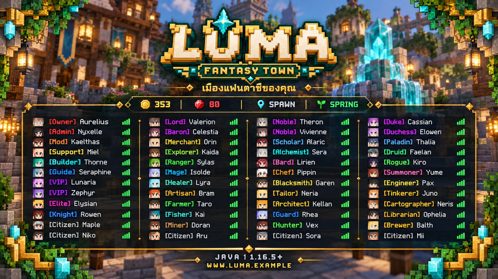
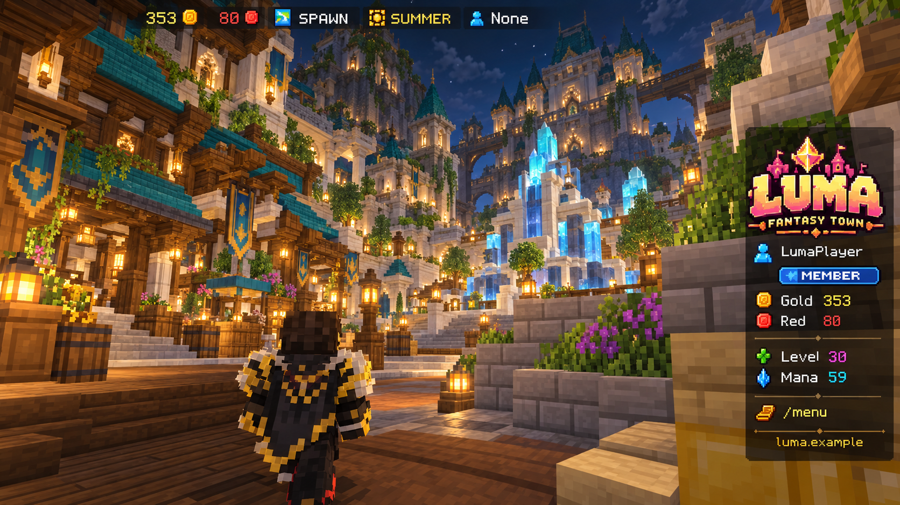

# Luma — MOTD, TAB, scoreboard และแถบสถานะตามภาพผู้ใช้

ฉบับ 5 ตุลาคม 2026 ข้อกำหนดนี้มีความสำคัญ: ผู้ใช้ต้องการองค์ประกอบแบบภาพอ้างอิง ไม่ใช่ scoreboard ข้อความสีธรรมดา
ใช้ layout/ความหนาแน่น/ตำแหน่งจากภาพ โดยผลิตโลโก้ กรอบ และไอคอนของ Luma เอง

## ภาพออกแบบของ Luma



ภาพใหม่จัด 4 คอลัมน์ตามแนวอ้างอิง โลโก้ใหญ่ด้านบน rank สี ping และ footer พร้อมสีเขียวหยก–ทอง
เป็นภาพออกแบบ ข้อมูลผู้เล่นและเงินในภาพเป็นตัวอย่าง ภาพขอบรอบจอไม่ใช่หลักฐานว่า native TAB วาดได้ทุกตำแหน่ง



ใช้ตำแหน่งแถบบนและ sidebar จากภาพผู้ใช้ โลโก้ทดลองในภาพ HUD รุ่นนี้ต้องเปลี่ยนเป็น [โลโก้ฉบับล่าสุด](brand/luma-logo.png) ก่อนผลิต font atlas
ดู [คู่มือแบรนด์](BRAND-GUIDE-th.md) สำหรับสีและ baseline การใช้งาน

## แยก UI ที่ผู้ใช้ให้มา

| ส่วน | ตำแหน่ง/ภาพอ้างอิง | วิธีทำ |
|---|---|---|
| MOTD | รายชื่อเซิร์ฟก่อนเข้า ภาพ Applecraft | MiniMOTD + MiniMessage RGB/gradient + server icon PNG |
| Sidebar scoreboard | ด้านขวาภาพ SIXPIXEL | TAB scoreboard + bitmap glyph logo/rank/icons ใน resource pack |
| TAB | โลโก้ใหญ่ด้านบน รายชื่อหลายคอลัมน์ กรอบรอบขอบ ตามภาพ TomatoLand | TAB header/footer/name formatting/sorting; ประเมิน layout featureของ buildที่ซื้อ |
| Top HUD | แถบบนสุด Gold / Red / SPAWN / SUMMER / guild | bossbar/text-glyph renderer ใน FantasyCore HUD adapter; ทดสอบตำแหน่งบนหลาย GUI scale |

ภาพหน้าจอไม่ได้พิสูจน์ว่าต้นฉบับใช้ pluginใด รายชื่อนี้เป็น implementation ที่เสนอสำหรับ Luma

## รูปแบบที่ล็อกตามภาพ

**Sidebar ขวา:** พื้นหลังโปร่งดำของเกม, โลโก้ pixel3D ใหญ่บนสุดกว้างประมาณ140–180pxในภาพอ้างอิง, ชื่อรองตัวเล็ก, ไม่ใช้ titleข้อความธรรมดาแทนlogo
ใต้โลโก้เว้นช่องไฟหนึ่งบรรทัด มีแถวผู้เล่น+ชื่อสีเขียว, rankbadgeภาพสีน้ำเงิน, goldiconสีทอง, rediconสีแดง, เว้นช่วง, levelicon, manaicon, เว้นช่วง, คำสั่งเปิดเมนู, footerเว็บ
ตัวเลขชิดในแนวอ่านง่าย ขนาดไอคอน8–10px ป้ายrankประมาณ34×9px; ตัวเลขเหล่านี้เป็นเป้าหมายเทียบภาพ ต้อง calibrateบน clientจริง

```text
              [ LUMA LOGO ]
              FANTASY TOWN

  [player] ชื่อผู้เล่น: LumaPlayer
  [rank]   ระดับยศ: [MEMBER badge]
  [gold]   จำนวนเงิน: 353
  [red]    จำนวนเหรียญ: 80

  [level]  เลเวล: 30
  [mana]   มานาคงเหลือ: 59

  [!] /menu เพื่อเปิดเมนู

           [ที่อยู่เว็บจริง]
```

ตัวเลข/ชื่อเป็นตัวอย่างเท่านั้น ใช้ Core cache และ RPG adapterจริงเมื่อเปิดเซิร์ฟ ไม่ hardcodeแสดงว่าผู้เล่นมีเงิน
fontglyphมี labelอ่านข้อความใน fallback ห้าม private-useglyphล้วนจนคนไม่รับpackเห็นกล่องสี่เหลี่ยม
อย่าใช้ชื่อ/โลโก้ SIXPIXEL หรือลิงก์ร้านต้นฉบับบน Luma

**Top HUD:** บรรทัดเดียวตามภาพ: gold353, red80, locationSPAWN, seasonSUMMER, guildNone มีสีแยกความหมาย ไม่แสดงข้อมูลธนาคารเป็นยอดติดตัว
HUDไม่แสดง bossbar progressสีทึบยาวถ้าแบบต้องการข้อความอย่างเดียว ต้องทดสอบ skinของbossbarหรือเลือกrendererที่ทำได้จริง
ระหว่างสู้บอสให้ bosshealthใช้ช่องแยกหรือซ่อนข้อมูลเมืองชั่วคราว ไม่ให้2rendererแย่งbarเดียวกัน

**TAB:** headerโลโก้bitmapกลางบน, slogan/ข้อความสั้น, รายชื่อเรียงยศแล้วชื่อ, pingขวา; footeronlinecount+เว็บ+IPจริง
กรอบใบไม้/คริสตัลที่ขอบซ้ายขวาและ footerใช้glyphประกอบ ไม่ใช้ภาพพื้นหลังเว็บหรือscreenoverlayที่vanillaไม่มี
ธีม Luma เปลี่ยนกรอบผลไม้เป็นใบไม้เขียวหยก/คริสตัลทองเล็ก แต่กรอบและพื้นที่กลางต้องมีสัดส่วนใกล้ภาพ
vanillaTABไม่มีcanvasอิสระ: ขนาดแผงขึ้นกับจำนวนผู้เล่น/ความกว้างข้อความ/clientsettings การทำเหมือนภาพทุกpixelทุกresolutionไม่ใช่สิ่งที่รับรองได้ล่วงหน้า

## Plugins และผู้ถือการแสดงผล

- [TAB](https://github.com/NEZNAMY/TAB/wiki) จัด scoreboard + tablist ใน backendหรือproxyชั้นเดียว
- [MiniMOTD](https://github.com/jpenilla/MiniMOTD) จัดข้อความหน้าserverlist รองรับRGB1.16+ และMiniMessage
- PlaceholderAPI + FantasyCoreExpansion ส่ง `%fantasy_*%` จากmemorysnapshot ไม่querySQLในplaceholder
- Pack ownerเดียวรวม fontimages + ModelEngine + itemmodels ตาม MODEL-AND-CONTENT-PLAN
- ไม่ติดscoreboardpluginอีกตัวให้สร้างobjectiveเดียวกับTAB; MMO/RPGHUDอื่นให้เลือกเจ้าของtopbarอย่างชัดเจน

TAB animationกำหนดใน animations.yml ตาม [เอกสาร animations](https://github.com/NEZNAMY/TAB/wiki/Animations)
TAB ใช้ prefix/suffix เพื่อลด flicker; อย่าเปิด long-linebypassที่เปลี่ยนentryบ่อยบนแถว animated ตาม [scoreboard guide](https://github.com/NEZNAMY/TAB/wiki/Feature-guide%3A-Scoreboard)
Layoutfeature/ราคา/จำนวนคอลัมน์ขึ้นกับ release ตรวจ [layout guide](https://github.com/NEZNAMY/TAB/wiki/Feature-guide%3A-Layout) ของรุ่นที่ใช้ก่อนซื้อ ไม่รับรองภาพ4คอลัมน์สำหรับbuildใดโดยยังไม่ตรวจ

## Asset sheet ที่ต้องผลิต

| Asset ID | กลุ่มภาพ | เงื่อนไข |
|---|---|---|
| ui_logo_luma_sidebar | bitmaplogo | transparent, safealpha, targetdisplayกว้าง140–180pxตามGUIscale |
| ui_logo_luma_tab | bitmaplogo | รุ่นใหญ่ในheader, marginพอไม่ชนtext |
| ui_rank_member/vip/staff | badge | baselineเดียวกัน สีไม่ใช่ช่องทางเดียวบอกสิทธิ์ |
| ui_coin_gold/red | icon | สีทอง/แดง แบบภาพอ้างอิง, fallbackคำว่าเงิน/เหรียญ |
| ui_player/level/mana/location/season/guild | icon | readable8–10px, ไม่มีemojiระบบปฏิบัติการ |
| ui_tab_corner_tl/tr/bl/br | border | ไม่บังรายชื่อบนGUIscale1–4 |
| ui_tab_edge_left/right | repeatedglyph | sparseornament ไม่สร้างแผงทึบใหญ่ |
| ui_spacing | fontadvance | เลขspacingและช่องว่างสงวนร่วมกับpackowner |
| server_icon_luma | PNG64×64 | PNGขนาดตรงจริง ไม่ใช้ภาพ1024แทนแล้วอ้างพร้อมใช้งาน |

โลโก้ภาพAIเป็นbrandreference/sourceart ต้องเตรียมglyphatlasและค่าฟอนต์ให้runtime ไม่เอาภาพUIconceptไปใส่fontทั้งหน้า
จองUnicodeprivate-useช่วงหนึ่งให้Core เช่นU+E100..E1FF แล้วตรวจชนglyphกับitempack; เลขเป็นproposal ไม่ยึดก่อนตรวจregistry
อย่าเปลี่ยนfontไทยหลักเพื่อทำโลโก้; providerมีเฉพาะglyphที่สงวนไว้

## Animation ที่มีสีและอ่านได้

1. Logoให้นิ่งเป็นส่วนหลัก; shimmerเฉพาะขอบ/ตัวหนังสือประกาศแถวหนึ่งใช้8framesที่ยาวเท่ากัน
2. Intervalเริ่มต้น300–400ms ไม่ส่งทั้งscoreboardทุกtick; ข้อมูลเงินเปลี่ยนเมื่อtransactioncommitแล้ว
3. TABประกาศหมุนทุก8–12s, ไม่ใช้typewriterยาวที่ขยับความกว้างTABตลอดเวลา
4. ป้ายrankคงที่; manaอัปเดต250–500msจากsnapshotถ้าเล่นRPG; money/profile1sหรือeventdriven
5. คำสั่ง `/hud` เปิดเมนูเปิด/ปิดscoreboard/topbar/reducedmotion ไม่บังคับshowparticle

MOTDที่หน้าserverlistได้รับเมื่อclientping ไม่ใช่streamanimationต่อเนื่อง จะเปลี่ยนข้อความ/ไอคอนต่อpingได้ถ้าpluginรองรับ การติดpluginไม่ทำให้vanillaserverlistเล่นGIFตลอดเวลา
เป้าหมายสีสวยใช้gradientที่อ่านชัด+servericon ไม่อ้างanimatedMOTD60FPS

ตัวอย่าง TAB animationที่ใช้legacycolorอ่านง่าย; เป็นdraftให้mergeกับgenerateddefaultของTABversionจริง:

```yaml
LumaNotice:
  change-interval: 400
  texts:
    - "&6/menu &fเพื่อเปิดเมนูเมือง"
    - "&e/menu &fเพื่อเปิดเมนูเมือง"
    - "&f/menu &fเพื่อเปิดเมนูเมือง"
    - "&e/menu &fเพื่อเปิดเมนูเมือง"
```

ชื่อplaceholderที่ **ต้องเขียนเพิ่มในCoreExpansion** ไม่ได้มีอยู่แล้ว:

```text
%fantasy_wallet_gold% %fantasy_wallet_red% %fantasy_bank_gold%
%fantasy_level% %fantasy_mana_current% %fantasy_mana_max%
%fantasy_location_label% %fantasy_season_label% %fantasy_guild_name%
%fantasy_rank_badge% %fantasy_logo_sidebar% %fantasy_logo_tab%
```

## Acceptance ใกล้ภาพและไม่กระตุก

- screenshotเทียบreferenceที่resolutionเดียวกันและGUIscaleเดียวกัน; บันทึกโลโก้/rowbaseline/sidebarwidth/footer/topHUDตำแหน่ง ไม่อาศัยความรู้สึกอย่างเดียว
- client1.16.5, clientmodernlaunch, latestที่ประกาศ: acceptedpack/rejectedpack, fullscreen/windowed, GUIscale1/2/3/4, Thaiชื่อยาว
- 1/20/80/มากกว่า80ผู้เล่นในTABตรวจtruncation/columnoverlap, skin, ping, ranksorting, vanish/staffhidden
- ส่งเฉพาะlineที่เปลี่ยน ห้ามremove/recreateobjectiveทุกrefresh; `/reload`ไม่ใช้สำหรับโหลดระบบเงินใหม่
- profileCPU/serverMSPT/packetbandwidth/clientFPSเทียบHUDปิดกับHUDเปิดที่loadเป้าหมายจริง
- money/red/bankต้องตรงกับledger; logout/rejoin/เปลี่ยนworldไม่ทำเงินย้อน/แสดงข้อมูลคนอื่น
- animateสีได้โดยไม่ทำข้อมูลสำคัญอ่านไม่ออก จัดลำดับpacketและcancel taskตอนquit/disable

สถานะปัจจุบัน: สเปก/ภาพคอนเซปต์ ยังไม่ได้ติดTAB/MiniMOTD/packglyphหรือทดสอบFPSบนMinecraftจริง
