# Luma — กำกับภาพทั้ง 12 โซนให้สร้างจริง วาง NPC และตรวจความเนี๊ยบ

ใช้ร่วมกับ [แปลนภายในเดิม](INTERIOR-AND-MAP-PLAN-th.md) และ [ภาพ 12 โซน](ZONE-ILLUSTRATIONS-th.md)
ภาพเป็น mood/รายละเอียดตกแต่ง ขนาดและพิกัดจากตารางมีลำดับสำคัญกว่า perspectiveในภาพ
เป้าหมายพื้นที่400×400 เมืองหลัก280×280 สร้างบริการหลักก่อนเติมรายละเอียด ไม่กลับไปสเกล1200×1200

## กติกาพิกัดและการหันหน้า

- Xบวก=East, Zบวก=South; ศูนย์เมืองX0/Z0 ถนนหลักกว้าง9 ทางโซน5 โถงสำคัญ3–5
- ให้Y0เป็นระดับบล็อกพื้น เช่น80; เท้าNPCบนพื้นเต็มบล็อกอยู่Y0+1=81 ไม่ฝังเท้าในfloorblock
- localuเพิ่มไปขวาเมื่อยืนหน้าอาคารมองเข้าประตู localvเพิ่มเข้าด้านหลัง
- ตารางoriginเป็นมุมหน้า-ซ้ายของbuilding footprint จากภายนอก ไม่ใช่spawnหรือcenter

| หน้าตึกหันออก | u vector | v vector | NPCมองออกด้านหน้า: yaw |
|---|---|---|---:|
| North | (-1,0) | (0,+1) | 180 |
| South | (+1,0) | (0,-1) | 0 |
| East | (0,-1) | (-1,0) | -90 |
| West | (0,+1) | (+1,0) | 90 |

`X,Z = origin + u*uVector + v*vVector`; ใช้blockcenter.5เมื่อวางเท้าบนtile
Minecraft yaw0=South,90=West,180=North,-90=East pitch0มองระดับ; targetTจากNPCNใช้ `yaw=atan2(-(Tx-Nx),Tz-Nz)*180/pi`
modelหันNorthในBlockbench แต่runtimeอาจมีการปรับแกน ต้องcalibrateด้วยdebugarrowแล้วบันทึกmodel-yaw-offset ไม่ใส่180เพิ่มให้ทุกตัวโดยเดา
Bodyfixedtowardcustomeranchor; headlookเฉพาะผู้เล่นในระยะ5–6และlineofsight, clamp±35° ไม่หมุนbodyตามผู้เล่นหลังเคาน์เตอร์
animationserviceไม่เลื่อนroot/เท้า awayจากanchor; ค้อน/ไม้เท้าไม่ชนคนหรือทะลุโต๊ะ

## Building origins ที่เสนอเพื่อให้ interiorlocalแปลงได้แน่นอน

| อาคาร | origin X,Z | W×D | หน้าตึก | กรอบfootprintโลก |
|---|---|---|---|---|
| หอรับรอง | 17,49 | 35×23 | North | X-17..17 Z49..71 |
| บ้านเควส | -55,-58 | 29×23 | East | X-77..-55 Z-86..-58 |
| หอกิลด์ | -20,-67 | 41×31 | South | X-20..20 Z-97..-67 |
| ธนาคาร | -50,-7 | 25×19 | East | X-68..-50 Z-31..-7 |
| โรงตีเหล็ก | 44,8 | 31×25 | West | X44..68 Z8..38 |
| หออาชีพ | 44,-90 | 25×21 | West | X44..64 Z-90..-66 |
| คอกสัตว์ | 88,82 | 19×15 | North | X70..88 Z82..96 |

origin/กรอบนี้เป็นplacementproposal ไม่ใช่พิกัดที่อ่านมาจากworldจริง ถ้าterrain/assetจริงชนให้แก้originทั้งอาคารและregenanchors ไม่ขยับNPCแยกจนserviceหน้าเคาน์เตอร์ผิด
หลังคา/overhangต้องอยู่ในzonebuffer แปลนfootprintรวมwall1block ขนาดห้องใช้internalW-2/D-2

## Station registry ที่วางตามเคาน์เตอร์เดิม

ทุกแถวY=Y0+1; targetเป็นจุดยืนลูกค้า ใช้สำหรับbodyfacingและทดสอบlineofsight

| Station | NPC/template | ตำแหน่ง X,Z | target X,Z | yaw | Action |
|---|---|---|---|---:|---|
| spawn_guide | quest_warden variantguide | -8.5,15.5 | -3.5,15.5 | -90 | navigation.main |
| welcome_rewards | quest_warden concierge | 9.5,57.5 | 9.5,53.5 | 180 | reward.main |
| welcome_wardrobe | concierge variant | -10.5,57.5 | -10.5,53.5 | 180 | cosmetic.wardrobe |
| quest_gold | quest_warden | -64.5,-63.5 | -60.5,-63.5 | -90 | quest.gold |
| quest_red | quest_warden redtrim | -64.5,-81.5 | -60.5,-81.5 | -90 | quest.red |
| guild_keeper | portal_mage nobattle | -11.5,-77.5 | -11.5,-73.5 | 0 | guild.main |
| rank_keeper | archivist variant | 11.5,-77.5 | 11.5,-73.5 | 0 | progression.rank |
| bank_teller | arcane_banker | -62.5,-19.5 | -58.5,-19.5 | -90 | bank.main |
| forge_craft | rune_smith | 55.5,13.5 | 51.5,13.5 | 90 | craft.main |
| forge_upgrade | rune_smith variant | 55.5,23.5 | 51.5,23.5 | 90 | upgrade.main |
| forge_repair | rune_smith | 55.5,33.5 | 51.5,33.5 | 90 | repair.preview |
| jobs_master | jobmaster variant | 59.5,-77.5 | 55.5,-77.5 | 90 | jobs.main |
| portal_keeper | portal_mage | 55.5,-12.5 | 55.5,-17.5 | 180 | travel.main |
| market_artist | artist merchant variant (ยังไม่มีโมเดล) | -91.5,57.5 | -91.5,54.5 | 180 | canvas.main |
| market_alchemist_d (proposal) | npc_lyra_alchemist | -69.5,68.5 | -69.5,72.5 | 0 | market.main (ยังไม่เชื่อม) |
| pet_keeper | petkeeper variant | 78.5,78.5 | 78.5,75.5 | 180 | pets.main |
| fisher | fisher variant | 94.5,100.5 | 94.5,103.5 | 0 | fishing.catalog |
| afk_caretaker | healer variant | -125.5,10.5 | -125.5,7.5 | 180 | afk.info |

ยังไม่มีtemplateทั้งหมดในตารางถูกผลิต: pilotมี4ตัว; variant/ใหม่ใช้catalogส่งงานตามลำดับ
Marketstationsกำหนดในticket06ด้านล่าง รูนไม่มีactiveNPCในlaunch
บริการ RTP/daily/skins/exchange/home เพิ่มผ่าน station เดิมตาม [สเปกชุดระบบใหม่](CASUAL-SURVIVAL-SYSTEMS-th.md)
NPCหนึ่งตัวเรียกเมนูรวมได้เพื่อลดจำนวน อย่าสร้างspawnซ้ำทุกreload; persistentstationIDเป็นkeyเดียวกันทั้งCore/BlueMap/admin

## 01 ลานคริสตัล — จุดเกิดและนำทาง

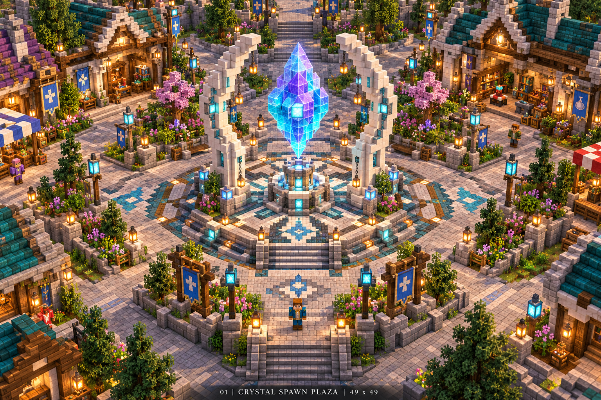

- กรอบ49×49; แท่น9×9อยู่กลาง คริสตัลvanillaglass7×11เป็นชิ้นบล็อกหลัก; ซุ้มหินสูงประมาณ17สองฝั่ง
- ถนน9blockทั้ง4ทิศต่อจนผ่านขอบลาน ลายรูนใช้concrete/terracottaเสมอพื้น ไม่ใช้trapdoor/slabเปลี่ยนระดับใต้เท้า
- Spawn(0.5,12.5)เท้าY0+1บนtileแห้ง มีช่องอากาศสูง3blockและพื้นเต็มใต้ตัว
- Guideอยู่ตามregistry ไม่บังเส้นเข้าwelcome/quest; ป้ายไทย4ทิศ วางม้านั่งออกนอกroadclearance
- **ทำmodelใหม่:** navigationcompass/ป้ายสัญลักษณ์ optional; ไม่ทำคริสตัลใหญ่นี้เป็นentitymodelเพียงเพื่อสวย
- Animationguideidle/greet; crystalparticleเฉพาะใกล้ระยะ24และลดได้ ไม่วนcommandblockทุกtick
- ตรวจ: firstjoin/respawn/warpต่างyawไม่ตกน้ำ, lineofsightguide, คืนจากdungeonไม่ไปยืนบนคริสตัล

## 02 หอรับรอง — รางวัล ตู้จดหมาย และชุดตกแต่ง

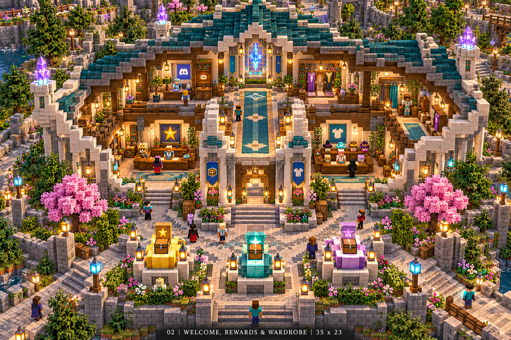

- อาคาร35×23สูงภายใน6 ประตูu15..19 ทางกลางu15..19/v1..20ต้องว่างตามinteriorเดิม
- ซ้ายlocalu3..11/v5..6rewardcounter ขวาu24..31/v5..6wardrobe; NPCอยู่หลังcounterไม่ฝังตัวในdesk
- มุมหลังซ้ายu3..10/v15..19mailbox/barrel ลิ้นชักตกแต่งไม่เก็บdeliveryจริงในchest
- ลานหีบ3แท่น3×3 เว้นช่อง3 และไม่บังประตู; เปิดcratepreviewก่อนใช้key
- **Model:** mailboxเปิดฝา, sealedrewardchest, hatdisplay, concierge variant; ใช้กล่องหลายใบเป็นtexturevariant
- Animationgreet/offerparcel; lidเปิดเมื่อดูpreviewไม่เป็นตัวตัดkey/reward
- ตรวจ: dailyBangkok, starteronce, offlinewebdelivery, fullinventoryเข้ากล่องจดหมาย, ปิดGUIกลางclaimไม่รับซ้ำ

## 03 บ้านเควส — ทอง/แดงและโต๊ะแผนที่

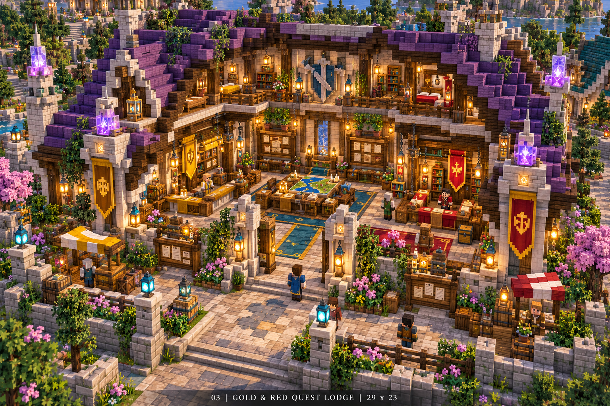

- 29×23 ประตูu12..16 โถง5block เคาน์เตอร์ทองu2..8/v6..7 แดงu20..26/v6..7
- บอร์ดหลังu3..9และ19..25/v18..20; โต๊ะแผนที่u11..17/v16..19 มีทางอ้อม3block
- ห้องชั้นบนเป็นlore/ห้องพัก บริการรับส่งเควสไม่ซ่อนไว้ชั้นบน
- **Model:** quest_warden, scroll, questcrestgold/red, maptableoptional; โครงโต๊ะใช้vanillาบล็อกได้ถ้าประหยัด
- Greet/offer_scrollกับแขนคนละbone; iconquestเหนือหัวจำกัดระยะและใช้labelไทย
- ตรวจ: NPCหันEastทั้งสอง ลูกค้าเห็นหน้าทั้งคู่ เควสถอนของถูกID/จำนวน มีpreviewrewardและcancel

## 04 หอกิลด์และเวทมนตร์ — รวมตัวและความก้าวหน้า

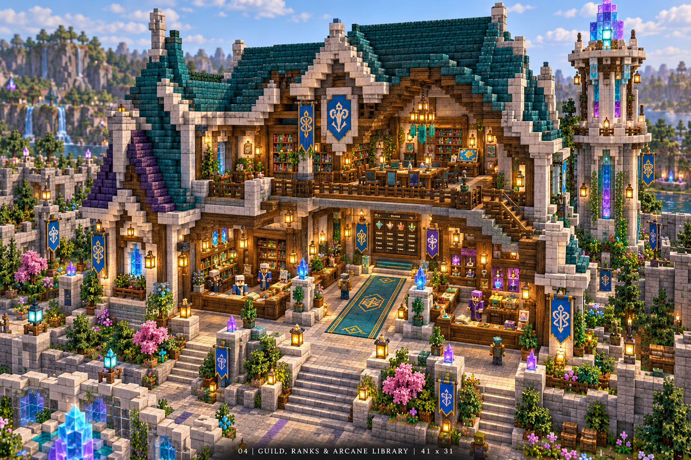

- 41×31สองชั้น; ชั้นล่างclearheight6 ชั้นบนh8..12 หอ9×9สูงประมาณ42 อยู่ในzonebuffer
- guildcounteru3..13/v7..8 rankcounteru27..37/v7..8 กลางu18..22ปล่อยว่าง
- บันไดหลังซ้ายu3..7/v18..27ตรวจlandingและrailingทุกชั้น ไม่ให้bannerบังศีรษะ
- ชั้นบนโต๊ะ15×3บริเวณu13..27/v12..14 ที่นั่ง8จุดและชั้นcatalogสองฝั่ง
- **Model:** guildcrest 4variants, archivist, bookstand; ไม่spawnNPCทุกสมาชิกกิลด์
- Animationreadbook/greet; headlookไม่ขยับหมวก/hoodคนละทิศ
- ตรวจ: guildroleไม่เท่ากับadminpermission, rankpreviewแสดงเงื่อนไข, staircaseขึ้นลงไม่ติดhalfslab

## 05 ธนาคารเวทมนตร์ — ฝากถอนและคลัง

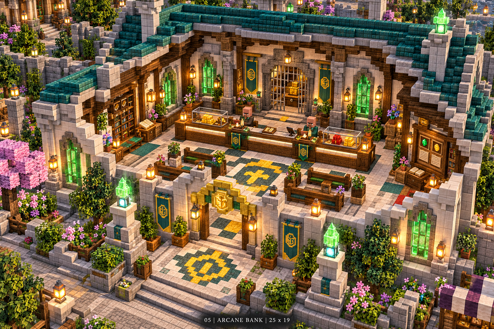

- 25×19 เคาน์เตอร์u5..19/v10..11; customeru10..14/v5..9; tellercenterหลังcounterv12.5
- Quartz+spruce ขอบทอง2ช่อง ตู้glassgold/redสองฝั่ง ฝั่งหลังเป็นvaultironbarsพร้อมทางเจ้าหน้าที่3block
- Vaultเป็นฉาก ไม่ใช้physicalchestหรือhopperเก็บเงินผู้เล่น; lockroom/doorไม่เป็นเงื่อนไขsecurityข้อมูล
- **Model:** arcane_banker, coin_stack, vault_key, ledger; coinprescribedmax3displayกองต่อroom
- Animationcount_coinsเฉพาะtransactionfeedback ไม่replayทุกhoverbutton
- ตรวจ: tellerfaceEastตรงtarget, wallet/bank/redไม่ปน, withdrawamountvalidated, concurrentclickไม่dupe, crashreceiptไม่หาย

## 06 ตลาดแฟนตาซี — ร้าน วัตถุดิบ ยา และออเดอร์

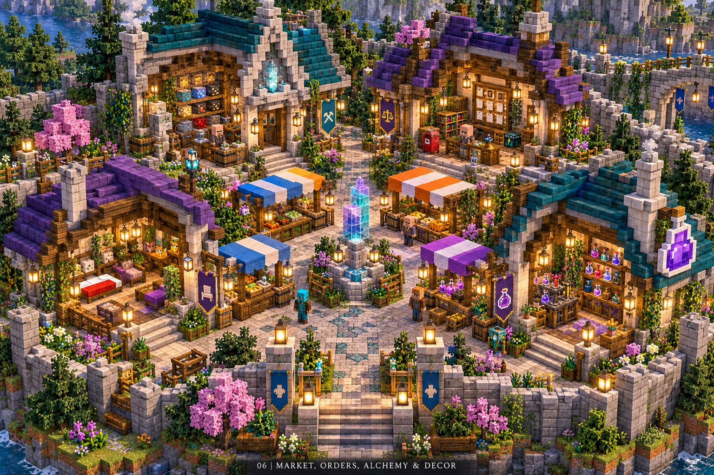

- 4shops11×13 +6stalls5×5ในกรอบX-110..-40/Z10..95; ซอยหลัก5blockไม่ใช้โต๊ะคีบถนน
- ShopA/B/CfacesEast origins(-45,29),(-45,51),(-45,73); ShopDfacesSouthorigin(-75,78)
- A/B/C NPCu5.5/v9.5: (-54.5,23.5),(-54.5,45.5),(-54.5,67.5) yaw-90 targetX+4
- D NPCu5.5/v9.5=(-69.5,68.5) yaw0 targetZ+4; Dใช้ร้านยา/ตำราไม่ขวางroute
- stallsวางคอลัมน์X-91และ-78ตามZ21/39/57ตรวจbufferกับShopD; ขนาด5×5มีcounter1block high
- วางบอร์ดordersหลังcounter ตู้รับของข้างร้าน และป้ายค่าธรรมเนียมก่อนsubmit
- **Model:** merchant, alchemist, shop_sign4symbols, herbjar/fishcrate/scale; ใช้vanillabarrels/cratesส่วนใหญ่
- Animationmerchantgreet, alchemiststirone-shot; jarไม่ใช้physicsที่เก็บpickupผิด
- นักปรุงยา [ไลรา](../../server/content/npc-models/LYRA-ALCHEMIST-th.md) ผลิตแล้ว: 206cubes/21bones/atlas512/5ท่า; หม้อและเตาติด root อยู่ข้างขวา ไม่ซ้อน cauldron block และเว้นพื้นที่3×3/สูง3สำหรับทุกท่า; renderer/ตลาดยังไม่เปิด
- แผงเดิมที่ X-91/Z57 ใช้ artist/easel/palette สำหรับ Canvas ตาม station registry; วาง counter ไม่บัง target และถนน ไม่เพิ่มอาคารใหญ่
- ตรวจ: buy/sellราคาserver, orderescrowpartialfill/refund, itemserialboundpolicy, webไม่เปิดorderคนอื่น

## 07 โรงตีเหล็กรูน — คราฟต์ อัปเกรด ซ่อม

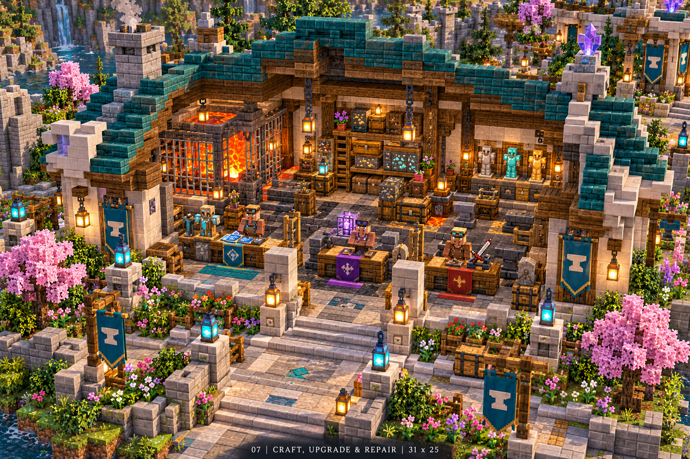

- 31×25 ระดับcounterv8..9แบ่งu2..9craft/u11..19upgrade/u22..28repair; stationตามregistryมองWest
- ทั่ง/เตาวางหลังv15..22 smokeexitถึงหลังคา; counterหน้าเห็นจากstreet ไม่บังคับเดินผ่านforgefire
- วัสดุลาวาอยู่หลังกระจก/regiondamageoff ไม่มีfloorholes; โครงtimberจริงมีจุดยึดไม่ลอยทะลุchimney
- **Model:** rune_smith, hammer, tongs, weaponrack, rune_anvilถ้าต้องการใหม่; ไม่ทำเตาทั้งอาคารเป็นentity
- Hammerworkslotใช้animated smithต่างจากrepairtellerที่greet; bodyต้องนิ่งหันลูกค้าในcountervariant
- ตรวจ: ค้อนไม่ทะลุcounter/เพดาน, repairเก็บstat/roll/gem/soulbound/serial, previewfeeไม่ตี500ทุกชิ้นโดยเดาคลิป

## 08 ลานอาชีพและฝึกฝน — เรียนรู้แบบเลือกเอง

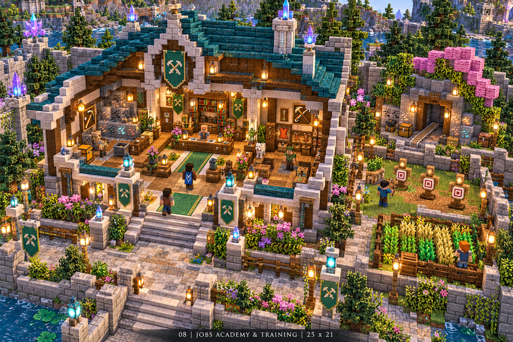

- หอ25×21และลาน21×17; jobsNPCหลังcounteru6..18/v13..14 โถงกลาง5block
- Dummy3–4ตัวลานแยกด้วยwall/targetframe ตัวที่รับdamageเปิดเฉพาะregiontest ไม่ให้ตีserviceNPC
- ป้ายXP/รายได้/ข้อจำกัดและปุ่มleavejobที่บอกผลก่อนยืนยัน; ห้องroleplayเป็นoptional
- **Model:** jobmaster, professiontool3หลัก, trainingdummy1rigvariant; DPSnumberpopupจำกัดrate
- Animationdummyhitrecover, ไม่ใช้NPCpathfindingเดินไปหาผู้ตี
- ตรวจ: Projectileไม่ทะลุไปตลาด/เมือง, jobrewardไม่ฟาร์มจากdummy, trainingDPSไม่มีrewardsboss

## 09 ประตูผจญภัย — ปลายทางอ่านง่ายและลงจอดปลอดภัย

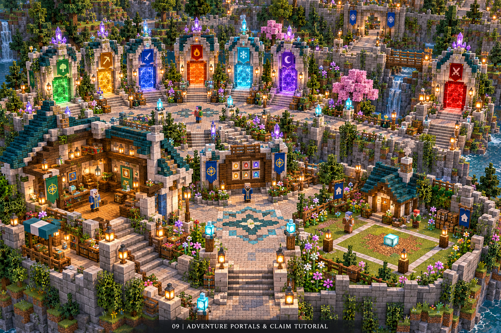

- กรอบ76×31 ซุ้ม7จุดวางเหนือ4/ใต้3ขนาด7–9wide/9–11high ทางกลาง5blockคงว่าง
- labelโลกสำรวจ/ทรัพยากร/dungeon/3boss/PvPสื่อหน้าที่และdifficulty; previewปลายทาง+cooldownก่อนวาร์ป
- Mageตามregistryไม่ยืนกลางwarptrigger; claimsample13×13กับบ้าน7×7อยู่มุมแยก
- sample Protect ในมุมสอนใช้ขอบจริง 11×11 ของระดับ I; ป้ายแสดง 21/31/51/81 ตาม [Protect tiers](PROTECTIONSTONES-TIERS-th.md) ไม่สร้าง demo ทุกขนาดใน lobby
- **Model:** portal_mage, portal_focus/crystal และgatecrest; archใช้บล็อก แสง/particleเป็นส่วนเสริม
- Castone-shotเมื่อยืนยันtravel; no loopcastตลอดspawn; warpไม่รอanimationจนtransactionค้าง
- ตรวจ: destinationloaded, solidfloor2×2, headroom3, region/PvPstate, cooldown/logout/retryไม่วาร์ปซ้ำและไม่ตกvoid

## 10 สัตว์เลี้ยงและตกปลา — บริการพักผ่อน

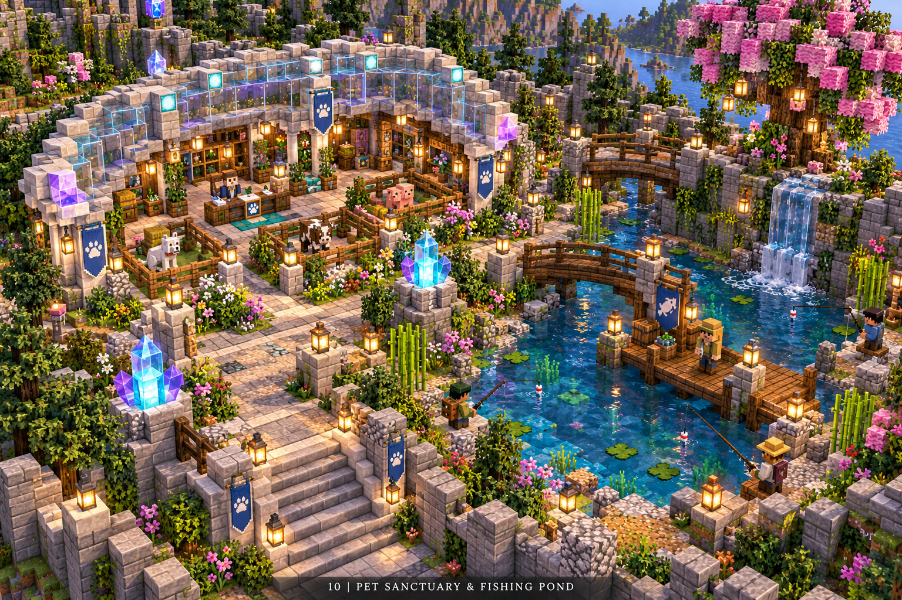

- คอก19×15ตามoriginและบ่อ27×19ประมาณX82..108/Z102..120; ทางริมบ่อ3–5blockและfishingtiles4–6
- Glassroofแบบขั้น ลำต้น/ประตูคอกไม่มีpixelclipping; previewpet3ช่องไม่เก็บmobsจริงหลายสิบตัว
- Petkeeperอยู่หน้าคอกไม่หันเข้ารั้ว Fisherอยู่shoreไม่ยืนในwaterfall
- **Model:** petkeeper/fisherใหม่, rune_cat/owl/crystal_snail/mini_golemตามลำดับ, fishing_rodskin/fishcrate
- Previewpetidlelowrate; companionfollowใช้runtimeและdistancecullingแยกจากserviceNPC
- ตรวจ: waterflowไม่ดันNPC, fishhookไม่ติดroof, bankซื้อpetไม่หักซ้ำ, cosmeticpetไม่ให้combatadvantageของร้านโดยไม่วางpolicy

## 11 วิหารพักใจ — AFKที่อ่านเงื่อนไขได้

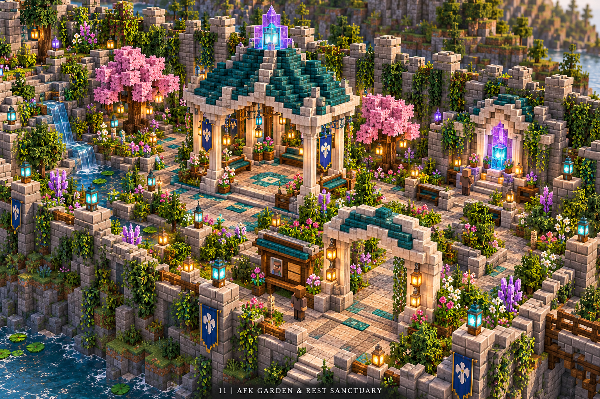

- กรอบX-135..-115/Z-25..30 ศาลา9×9กลางประมาณ(-125,8); ทางเข้า3blockเดินถึงถนนเมือง
- บอกเวลาเริ่มรางวัล/ยอดสะสม/เงื่อนไข, seatingdecorativeไม่ดักผู้เล่นในslab/boat
- **Model:** healer/caretakervariant, censeroptional; ไม่จำเป็นต้องมีentityทุกเบาะ
- Caretakeridle/greet; AFKregiontimestampนับออนไลน์จริงไม่ให้offlineaccrual
- ตรวจ: AFKfeatureมีเจตนาให้อยู่เฉย ๆ จึงไม่ตัดรางวัลเพราะไม่มีการขยับ หากมีantiabuseต้องกำหนดตามเวลาจริง/บัญชี/regionและนโยบายที่ประกาศ

## 12 ลานรูนโบราณ — สงวนพื้นที่เนื้อหาอนาคต

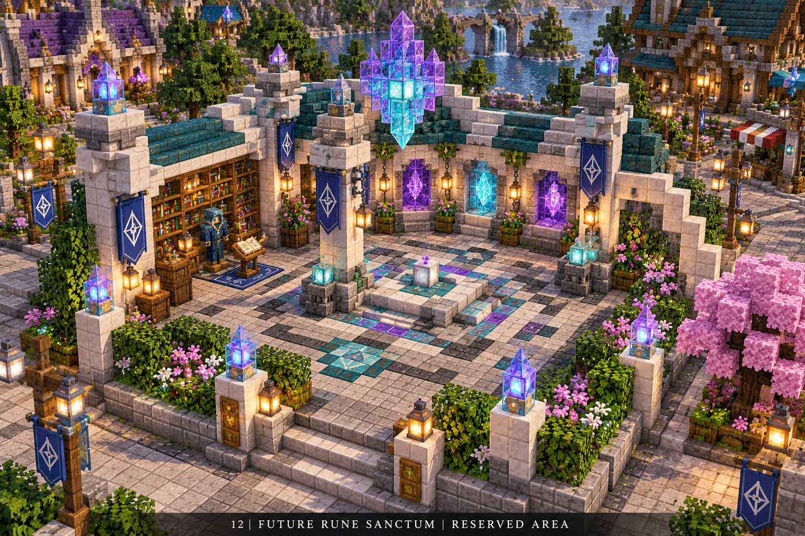

- แพลตฟอร์ม15×15แท่น5×5เสา4มุมสูง5–7ในX-25..25/Z-135..-115
- ป้าย “พื้นที่ขยายในอนาคต” ไม่มีNPCที่เปิดเมนูupgradeฟรี/วาร์ปไปworldไม่พร้อม
- **Model:** rune_plinth/stonecrestoptional; activewizardเก็บไว้phaseหลัง ไม่สร้างตอนlaunchเพียงเติมพื้นที่
- Lightparticleoffเป็นค่าเริ่มต้น; แสงจริงมาจากsea lantern/endrodที่client1.16.5เห็น
- ตรวจ: no hiddenportal/commandblocktrigger, no exposedstaffroom, expansionpath5blockคงไว้

## ตรวจแมพและบล็อกก่อนส่งมอบ

| กลุ่ม | ตรวจให้ผ่าน |
|---|---|
| seams | wall/roofต่อกริดเดียวกัน ไม่ชนcubefaceซ้ำให้z-fighting; ไม่มีairgapผิดแบบ/บล็อกลอยไม่ตั้งใจ |
| stairs/slabs | facing/half/type/waterloggedถูก บันไดต่อlandingจริง railingsไม่ปิดช่องเดิน |
| gates | fence/wallconnectionsมีเสารับ; เปิดประตูแล้วมีspaceครบ ไม่ชนmodel/hologram |
| surfaces | ถนนระดับเดียว ไม่มีtrapdoorbounce/carpetstack/iceที่ไม่ตั้งใจ; solidblockใต้ทุกwarp |
| lighting | ตรวจกลางคืนด้วยvanillaclientno shader/no fullbright; regionmobspawnpolicyจริง |
| limits | Y16..200สำหรับcontentหลักเพื่อlegacy; worldborder/voidbarrier/ถนนออกเมืองครบ |
| regions | spawnPvPoff/buildoff; forgefireoff; trainingonlydamagedummy; marketcontainerprotected |
| entities | collisionhitboxและinteractionreachจริง ชื่อ/ป้ายไม่แย่งคลิก; reload/chunkunloadไม่spawnซ้ำ |
| consistency | ทุกstationID/zoneID/warpIDเชื่อมactionเดียวกับเว็บ/BlueMap/admin ไม่คัดcoordsหลายไฟล์ |

สร้างstagingworld copyจริงก่อนตรวจgeometry; เวอร์ชันภาพ/แปลนไม่เป็นหลักฐานว่าแมพผ่าน
เก็บroutevideoเดินจากspawnถึงทุกstation, screenshotsfrontNPC+compass, regiontest, issue listและแก้P0/P1หมดก่อนlaunch
เครื่องมืออัตโนมัติช่วยหาcollision/airgap/warpunsafeได้ แต่ต้องwalkthroughจริงทุกอาคารและclientmatrixเพื่อรับงาน
