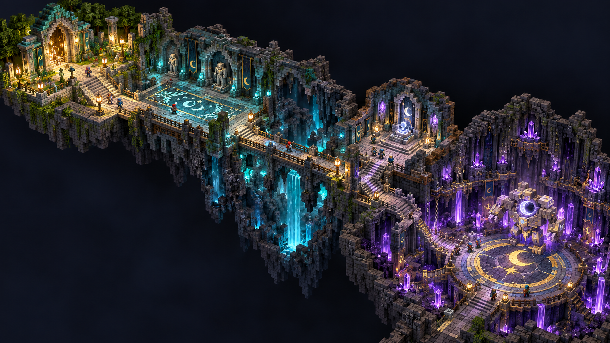
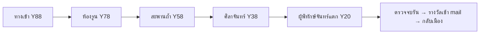
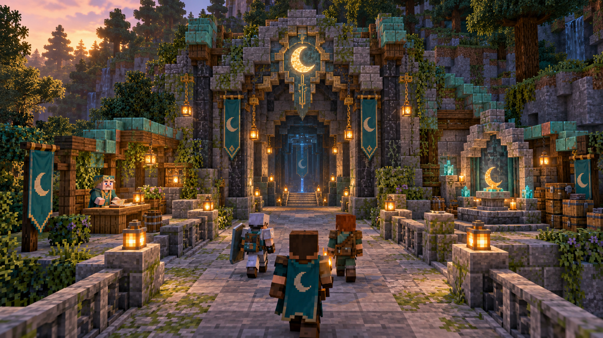
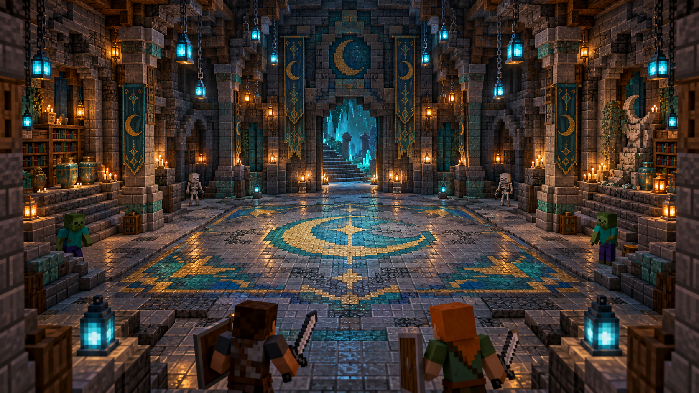
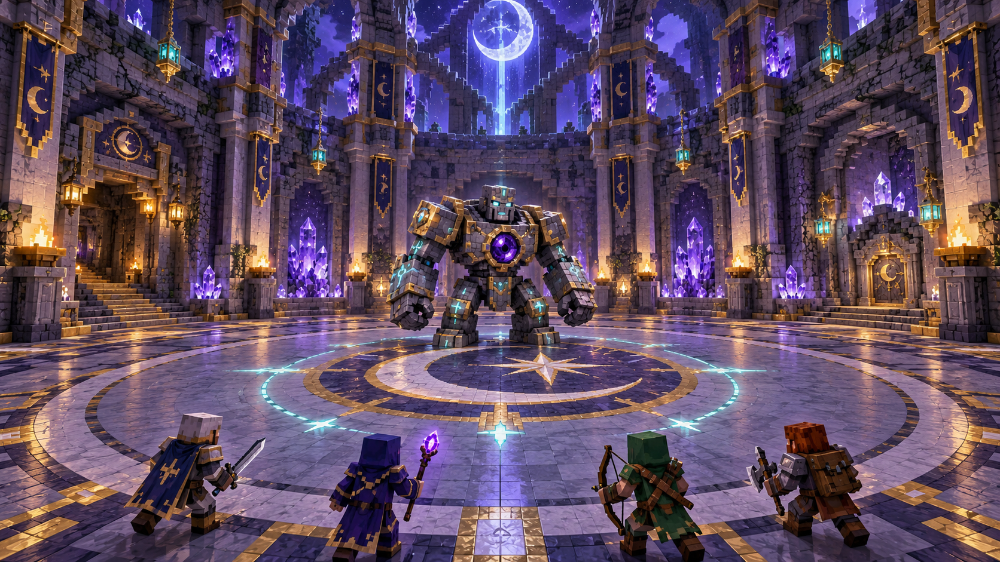

# ดันเจี้ยนแรก: ซากวิหารจันทรา — Moonfall Sanctum

**มีในแผนเซิร์ฟ:** เริ่ม 1 dungeon tier + 1 boss encounter ให้เล่นครบก่อนขยาย ตาม [SERVER-SYSTEMS §7/§13](../../SERVER-SYSTEMS-PLAN-th.md)
เอกสารนี้มีภาพ AI 4 ภาพและใบงานสร้างแมพ/ระบบ; **ยังไม่มี world/schematic/instance หรือบอสที่เล่นจริง**
อัปเดต v0.7: มี [โค้ด Moonfall ฝึกเดี่ยว](../../../../fantasycore/DUNGEONS-th.md) สร้างโครงแมพใน `luma_moonfall_training`, 3คลื่น/บอสHusk/ทุบพื้น/receipt+mail/protect/กลับออกแล้ว แต่ยังไม่รัน Minecraft
v0.8 เพิ่ม [ปาร์ตี้/2ห้องส่วนตัว/reconnect60s](../../../../fantasycore/PARTY-DUNGEONS-th.md) แล้ว แต่ยังไม่รัน Minecraft
สะพานหุบเหว/NPCภายใน/บอสโมเดลและตารางencounterเป้าหมายภาพด้านล่างยังเป็นแผน; ค่าที่ใช้จริงให้ยึดคู่มือv0.8
สร้างภาพด้วย built-in `image_gen` ผ่าน skill imagegen; [prompt ทั้งชุด](PROMPTS-th.md)
ภาพแสดงสไตล์และบรรยากาศ ไม่ใช่หลักฐานว่าบล็อก/ทางเดินถูกทุกจุด ให้ใช้ขนาดและพิกัดในใบงานนี้เป็นตัวตัดสิน

## 1. ผังรวมและขอบเขต

**ตามภาพ 01 ให้สร้าง:** วิหารทางเข้า → ห้องทดสอบรูน → สะพานถ้ำ → ห้องศิลาจันทร์/มินิบอส → ลานผู้พิทักษ์จันทร์แตก
พื้นที่รวม **144×144 บล็อก**; แนวทางปาร์ตี้ 2–4 คน, โหมดฝึก solo และโหมดปกติ โดยเริ่มเปิดเพียงโหมดฝึกหลัง QA
เวลาเป้าหมาย 12–18 นาที; การเล่นจริงเป็นตัวตัดสินตัวเลขหลังติดตั้ง encounter runtime
ไม่สร้างเมือง/อาณาจักรเพิ่มในดัน; ใช้ 5 ห้อง ขอบเขตและกลุ่มม็อบจำกัด เพื่อควบคุมต้นทุนเซิร์ฟ

แนวคิดภาพเสนอtemplate `luma_dungeon_moonfall_template`; implementation v0.8 ใช้โลกtraining/party1/party2ชื่อคงที่ แยกrun IDและไม่clone/deleteโลกต่อรอบ ดูคู่มือปัจจุบัน
ใน template ใช้ local `u=0..143` ตะวันออก/+X, `v=0..143` ใต้/+Z; `X=X0+u`, `Z=Z0+v`
**Y ต่อไปนี้เป็นระดับเท้าผู้เล่น**: พื้นเดินเป็นบล็อก Y−1 ไม่ใช่บล็อกเดียวกับที่เท้ายืน
พื้นที่บริการทั้งหมด Y20–88, หลังคาสูงสุดเสนอ Y110; ใช้ได้ในช่วงภาพของ client 1.16.5 โดยยังต้องทดสอบ Via จริง

| พื้นที่ | กรอบ local | ระดับเท้า Y | สิ่งที่ต้องเว้นโล่ง |
|---|---|---:|---|
| ทางเข้า | u8..36, v8..32 (29×25) | 88 | เส้นเดินกลาง u20..24 กว้าง 5 |
| บันได A | u20..24, v33..42 | 88→78 | 10 แถว ลดทีละ 1; หัว ≥4 |
| ห้องรูน | u10..34, v43..69 (25×27) | 78 | ลานกลาง ≥15×15; ประตูตะวันออกที่ v59..63 |
| บันได B | u35..54, v59..63 | 78→58 | 20 แถว ลดทีละ 1 |
| โถงสะพาน | u55..82, v49..73 | 58 | สะพานแนวตะวันออก u55..82, พื้น v59..63 |
| บันได C | u83..102, v59..63 | 58→38 | 20 แถว ลดทีละ 1 |
| ห้องศิลาจันทร์ | u103..129, v48..74 (27×27) | 38 | วงต่อสู้รัศมี 8, ทางออกใต้ u114..118 |
| บันได D | u114..118, v75..92 | 38→20 | 18 แถว ลดทีละ 1; ชานพัก v93..94 ที่ Y20 |
| ลานบอส | u93..139, v95..141 (47×47) | 20 | วงเดินเส้นผ่านศูนย์กลาง 41, ทางเข้าเหนือ u114..118 |

ก่อนปูบันไดให้วาง marker ระดับเท้าที่หัว/ท้ายทุกช่วง; ทดสอบเดินและ sprint-jump ทั้งสองทิศก่อนสร้างกำแพง
ช่วง Y ในตารางบันไดคือระดับ landing ต้น→ปลาย ไม่ใช่ Y เท้าคงที่ทุกครึ่งขั้น
บันได A ตัวแรก block Y87/ตัวสุดท้าย Y78, B Y77→58, C Y57→38, D Y37→20; floor block ที่ปลายใช้ Yเท้า−1
ใช้ stairs half BOTTOM และครึ่งสูงหันเข้าห้องต้นทาง เพื่อให้เดินลดครั้งละ0.5และถึงlandingสุดท้ายตรงระดับ
ไม่มี slab อื่นแทรกที่ทำให้ระดับจบคลาด0.5บล็อก; ราวข้างสูง 2 บล็อกในช่วงตกสูง
โถงสะพานเป็นภาพบรรยากาศถ้ำ มีพื้นสำรองด้านล่างและราวทึบ ไม่ทำ jump gap บังคับหรือทางไร้ราวตามภาพ AI
หากหมุนพื้นที่ ให้หมุนพิกัด NPC/ประตู/spawn พร้อมกัน; อย่าหมุนเฉพาะอาคารแล้วใช้ yaw เดิม

## 2. ภาพทางเข้า — พื้นที่ปลอดภัย/เตรียมปาร์ตี้

**ตามภาพ 02 ให้สร้าง:** ซุ้มจันทร์ กำแพงหินผสมตะไคร่ หลังคา copper เก่า เสาโคม และเคาน์เตอร์ซ้าย/แท่นปาร์ตี้ขวา
ซุ้มประตูกว้างนอก 7 สูง 11; ช่องผ่านจริงกว้าง 5 สูง ≥5; พื้นทางเดินระดับ Y88 ไม่วางหินแตกที่ทำให้ติดเท้า
ทางกลางมีโคมอยู่นอกรัศมีเดินทั้งสองด้านทุก 6 บล็อก; ใบไม้/เถาวัลย์ตกแต่งบนผนังนอกช่องผ่านเท่านั้น
Palette หลัก stone brick 45%, cracked/mossy 25%, deepslate 15%, spruce 10%, copper/gold accent 5% เป็นสัดส่วนภาพเสนอ
legacy fallback สำหรับ deepslate/copper/amethyst ต้องผ่าน Via/resource-pack matrix; แสงหลักใช้ lantern/torch ที่เก่าเห็นได้

| จุดระบบ/NPC | local / ระดับเท้า | ทิศและงาน |
|---|---|---|
| ผู้เล่นเข้า instance | (22.5,88,12.5) | yaw0/pitch0 มองใต้/+Z ไปประตู |
| คนเฝ้าวิหาร | (12.5,88,18.5) | yaw−90 มองตะวันออก/+X เข้าเส้นเดิน; เปิดข้อมูลดัน/ออกจากปาร์ตี้ |
| แท่นเตรียมปาร์ตี้ | (31.5,88,18.5) | ตกแต่งนิ่ง 3×3; UI แสดงสมาชิก/อุปกรณ์/โหมด/Ready |
| จุดเริ่มการต่อสู้ | (22.5,88,30.5) | trigger ตรวจสมาชิก/Ready/สถานะก่อน lock run; ไม่ใช้ pressure plate อย่างเดียว |
| กลับเมืองก่อนเริ่ม | (12.5,88,12.5) | trigger/เมนูยืนยัน, ไม่แจก loot |

แอดมินต้องยืนระดับที่ NPC ยืนและหันตาม yaw ก่อนวาง; 0=ใต้, 90=ตะวันตก, 180=เหนือ, −90=ตะวันออก
**v0.7 ลงทะเบียน `dungeon.main` แล้ว**: ผูก NPC เฉพาะประตู Moonfall ในเมืองเพื่อเปิดเมนูสถานะ/เข้าโหมดฝึก ใช้ [คู่มือ](../../../../fantasycore/DUNGEONS-th.md)
ไม่ใช้ console warp ข้ามการจองรอบ; ป้าย “วิหารกำลังเตรียมเปิด” คงไว้จน build/protect/combat/Via ผ่าน checklist R จริง
เคาน์เตอร์บัง NPC ได้ต่ำสุดระดับเอว ห้ามบัง raycast คลิก; เว้นผู้เล่นยืนหน้าเคาน์เตอร์ 3×3

## 3. ห้องรูนและสะพานถ้ำ — สอนการหลบ/อ่านสัญญาณ

**ตามภาพ 03 ให้สร้าง:** พื้นลายจันทร์ flush กับพื้นธรรมดา เสาแนบขอบห้อง 6 ต้น โคมแขวน ช่องเกิดม็อบ และชั้นหนังสือในซุ้ม
ภาพใช้เป็นตัวอย่างวัสดุ/แสง/ความโล่ง; ทางเข้า/ทางออกจริงใช้พิกัดผัง ไม่คัดทิศบันไดในภาพแบบตรงตัว
ลานกลาง u15..29, v49..63; ทางเข้าทางเหนือ และออกตะวันออกที่ u34,v59..63
ซุ้มเกิดศัตรูเสนอ (13.5,78,47.5), (31.5,78,47.5), (13.5,78,66.5), (31.5,78,66.5); หัวโล่ง ≥3
spawn point ห้ามอยู่หลังเสาที่ม็อบออกไม่ได้/บน slab; มีทางออกจากซุ้มกว้าง ≥2 ไม่ทำ one-way cheese ledge
หยุด natural spawn ใน instance และให้ encounter manager สร้าง CUSTOM mob ของรันนั้นเท่านั้น
wave ฝึกเสนอ 4 melee + 2 ranged, เปิดทีละ wave หลังครบสมาชิกในห้อง; รวมพร้อมกันทั้ง instance ≤12 combat mobs
มอนสเตอร์ธรรมดาในดันฝึกเป้าหมาย HP30–50; โหมดปกติ HP50–80 เป็นค่าจูนเสนอ ไม่ใช่ config ที่เปิดแล้ว
รูนเตือนบนพื้นมีเวลาอ่าน ≥1.2 วินาทีก่อนตี; สี/รูปวงอ่านได้โดยไม่ต้องใช้ custom font/particle หนา

สะพานใช้พื้นกว้าง 5 และราวทึบ Y59..60 ที่ v58/v64; ตู้ของตกแต่งอยู่บน ledge แยกจากทางผ่าน
ห้ามวาง combat wave บนบันได B/C; spawn ในห้องเท่านั้น ป้องกันผู้เล่นถูกล้อมในช่องแคบ
น้ำตก/ผลึกเป็นฉากข้างทาง ไม่ไหลลงพื้น/เกิด bubble column/ผลักผู้เล่น และไม่ให้ตัก bucket
ใส่ฐานรับ/ทางคืนเข้าลานแทนการตก void; ต้องทดสอบ ender pearl, knockback, spider climbing และยิงจากขอบด้วย

## 4. ศิลาจันทร์และลานบอส

**ตามภาพ 04 ให้สร้าง:** ห้องบอสทรงกลมบนกรอบ47×47 เสาขอบ12ต้น ผลึกเฉพาะซุ้ม ลายวงจันทร์บนพื้น และเวทีเดินโล่ง
ศูนย์ลาน (116.5,20,118.5), รัศมีพื้นโล่ง20บล็อก; ผนัง/เสาอยู่นอกวง ไม่ให้ hitbox/ใบไม้กินพื้นที่หลบ
ประตูเข้าที่ (116.5,20,95.5) กว้าง5, สูง6; ประตู/ผนังล็อกได้เมื่อไม่มีผู้เล่นทับช่องเท่านั้น
จุดพักรางวัลเสนอ (138.5,20,128.5) ในซุ้ม ไม่กดรับ reward จน receipt จบรัน commit แล้ว
จุดออก (116.5,20,138.5) มองใต้ yaw0; เป้าหมาย exit ต้องเคลียร์ run membership (ปาร์ตี้lobbyคงอยู่หลังผ่านในv0.8) และส่งกลับ spawn เมืองที่ตรวจ landing จริง
เพดานเหนือ arenaโล่ง24บล็อก ไม่ลาก chain/ตกแต่งเข้าพื้นที่โจมตี

ห้องศิลาจันทร์ที่Y38มีมินิบอส **ผู้รักษาศิลา** เกิด (116.5,38,61.5), yaw90 มองไปประตูตะวันตก
มินิบอสสอนหลบ cone slamหนึ่งท่า พร้อมช่องอ่านท่า ≥1.2s; เปิดประตูท้ายห้องหลังยืนยัน mob UUID/encounter ถูกกำจัด
บอสสุดท้าย **ผู้พิทักษ์จันทร์แตก** เกิดศูนย์arena, yaw180 มองประตูเหนือ; หมุนตามเป้าหมายโดย runtime โดยไม่เปลี่ยนจุด anchor ของ skill
บอสขนาดภาพประมาณสูง4–4.5บล็อก; ไม่ใช้ hitboxเต็มโมเดลทุกแขน ให้ colliderเคลื่อนได้ในประตูและกลางarena

| Encounter proposal | โหมดฝึก | โหมดปกติ | กติกา |
|---|---:|---:|---|
| มินิบอสฐานsolo | 140 HP | 220 HP | scaleปาร์ตี้ก่อนเกิด; ไม่มี depth listener คูณซ้ำ |
| บอสฐานsolo | 360 HP | 540 HP | HPเสนอ ×[1+0.55×(สมาชิกตอนlock−1)] |
| damage rawท่าปกติ | 4 HP | 6 HP | จูนร่วมกับเกราะ/Enchant และเวลาหลบจริง |
| damage rawท่าหนัก | 6 HP | 8 HP | ท่าอ่านได้/มีทางหลบ; ไม่ one-shot ด้วยโบนัสซ้อน |

ตัวเลขเป็น design candidate แยกจากมอนสเตอร์โลกทรัพยากรที่ cap200HP; ไม่ได้ใส่ลง JAR/เริ่ม encounter แล้ว
ท่าบอส: กวาดวงจันทร์เป็นcone, กระแทกพื้นเป็นวงเตือน, เรียกเงาศิลา2ตัว; cooldownรวม ≥6s, ท่าหนัก ≥12s
phase2 เมื่อ HP≤60% เพิ่มรูปแบบวงหลบก่อนเพิ่มตัวเลข; phase3 HP≤25% สลับท่า ไม่คูณdamageเพิ่มฉับพลัน
เรียกลูกน้องไม่เกิน2ชุดต่อสู้และนับรวม mob cap12; ยกเลิก scheduled skills เมื่อ runสิ้นสุด/บอสตาย

## 5. Runtime/รางวัลที่ต้องสร้างต่อ

ใช้ MythicMobsสำหรับ AI/skill เมื่อรุ่นจริงผ่านcompatibility; Core/Dungeon moduleเป็นเจ้าของ run/party/checkpoint/rewardreceipt
ModelEngineเป็น candidateสำหรับบอสโมเดลหลังหาJAR/APIจริงและผ่านmatrix; ไม่ได้ติดตั้ง/ทดสอบ provider ในงานภาพนี้
ต้องมี API agreement ว่า HP/armor/lootของ encounter ออกโดย providerเดียว; [DepthMonsterService](../../../../fantasycore/MONSTERS-th.md) ข้าม CUSTOM spawn และโลกดัน

เส้นทางสถานะเสนอ `PREPARING → ACTIVE → BOSS → COMPLETING → COMPLETED → CLOSING`; ผิดกลางทางเข้า `REVIEW/ABORTED` ตามหลักฐาน
run ID + UUIDผู้เล่นล็อกตอนเริ่ม ป้องกันสลับปาร์ตี้เพิ่มเลือด/สิทธิ์loot และห้ามวาร์ปคนอื่นเข้าinstanceโดยคำสั่งลัด
instanceใช้templateที่เวอร์ชัน/hashตรึงไว้; คืนstateหลังrestartไม่ได้ให้พาไปsafeexitและพักrewardไม่ชัดในREVIEW
reconnect graceเสนอ60s, checkpointsที่ทางเข้า/หลังห้องรูน/ก่อนบอส; จูนจำนวนคืนชีพก่อนเปิดจริง
ห้ามใช้shared dungeon worldให้สองปาร์ตี้เกิดม็อบ/รับlootร่วมโดยไม่ตั้งใจ

รางวัลแนวทาง: เสร็จโหมดฝึกให้เหรียญเควสจันทร์1 + วัตถุดิบรูน; ปกติ2 + ส่วนสร้างgear/cosmeticจากการเล่น
เริ่มไม่มีค่าเข้าดันเงินจริง ไม่มีpaid key เพิ่มcombatstat/dropchance; เว็บขายcosmeticตามนโยบายบาลานซ์เดิม
บันทึกreceipt unique(run_id,player_uuid,reward_version) และ grantเข้าCore mailพร้อมauditในtransactionเดียว
eventบอสตายซ้ำ/กดrewardซ้ำ/ออฟไลน์ตอนจบต้องไม่แจกซ้ำ; กระเป๋าเต็มยังรอmail ไม่โยนlootสำคัญลงพื้น
อย่าใช้GUI/chestprop เป็นแหล่งความจริงของreward; กล่องบนแมพเป็นของตกแต่งหรือเปิดเมนูที่ตรวจreceipt
XP/เงินแดง/ตารางดรอปRareต้องจูนจากเวลารันจริงก่อนเปิด ไม่ทำรายได้ฟาร์มบอสซ้ำเกินเศรษฐกิจเมือง

## 6. ส่งต่อโมเดล/แอนิเมชัน

ภาพ04เป็นrefทรงบอส ยังไม่ใช่turnaround/texture/โมเดลที่ส่งเข้าเกมได้
งานถัดไป: ChatGPT generate front/side/backref → Antigravityส่งผ่านBlockbench MCPที่เชื่อมอยู่จริง → ตรวจmodel/texture/animations → exportprovider → staging
ห้ามรายงานว่าMCPสร้างแล้วเมื่อยังไม่มี .bbmodel/export/result; เก็บไฟล์แยกจากsourceแพ็กที่ผู้ใช้มี

ใบงาน `boss_moonstone_guardian`: สูง4.5blocks,กว้าง3, colliderเสนอ1.8×3.5, forwardตามcontractproviderที่ทดสอบไม่เดาแกน
เสนอ ≤64cubes/≤20bones, texture128×128; pivot/rootที่เท้า, แขนย้ายได้โดยไม่ลอดพื้น/ตัดกัน
clips: idle, walk, cone_sweep, ground_slam, summon, stagger, death; ท่าdeathต้องปลดhitbox/skillก่อนreward
แต่ละclipมีเวลาตรงtelegraph/impact; ลูกน้องใช้vanillaก่อนเพื่อลดงานmodelและข้อผิดพลาด
ทำfallbackสำหรับclientเก่าเมื่อไม่รับpack/packโหลดไม่ผ่าน ให้ทุกคนเห็น hitboxและสัญญาณหลบตรงกัน

## 7. เกณฑ์รับงานแมพและเปิดดัน

- [ ] สร้างเฉพาะtemplateก่อน ไม่เปิดjoinจริง; พิกัด/Yเท้า/ทิศประตูและNPCตรงตาราง
- [ ] วัดทุกบันได ลด1ต่อแถวจริง ไม่มีช่องหัวต่ำ/slabครึ่งระดับ/ประตูขวางเดิน
- [ ] พื้นcombatเสมอกัน ไม่ติดเสา/chain/prop; blockconnection/water/chunkseam/lightผ่านwalkthrough
- [ ] ไม่มีspawnในบล็อก/บนราว/บนบันได, spiderclimbing/enderpearl/knockbackไม่ออกนอกarenaหรือโจมตีบอสจากจุดปลอดภัย
- [ ] protect blockbreak/place/bucket/piston/explosion/hopper/prop pickup, ปิดnaturalspawnแต่อนุญาตencounter managerที่ตรวจrunID
- [ ] ไม่ปล่อยNPC/mobออกเมือง; logout/restart/วาร์ป/ตาย/party disband/สองinstanceไม่ทำให้ผู้เล่นค้าง
- [ ] Mobcap/skilltasks/particlesหยุดเมื่อrunclose; chunkunload/worlddeleteทำหลังทุกคนออกและไม่มีjobsค้าง
- [ ] HP/damage/telegraphตรงกันทุกclient1.16.5+; packfailยังหลบได้, animation/hitbox/phaseไม่ค้าง
- [ ] completion/rewardatomic/idempotent/mail/reviewผ่านfailuretests; ไม่มีการบังคับขายlootทางเว็บ
- [ ] เก็บMSPT/จำนวนentities/เวลาclearจริง,ปรับbalanceแล้วsign-offก่อนปลดป้ายกำลังเตรียมเปิด

ขยายขั้นต่อไปหลังผ่าน: ห้องเพิ่ม2แบบ/โหมดปกติ/ตารางRareและcosmeticชุดจันทรา โดยคง receipt/configversionเดิมให้อ่านย้อนหลังได้
