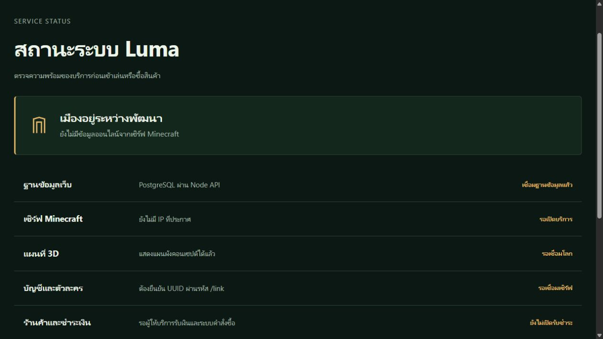
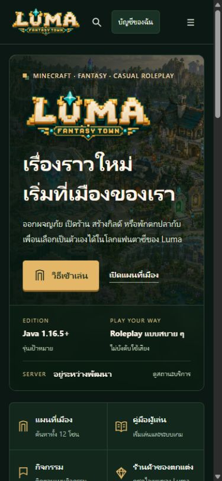
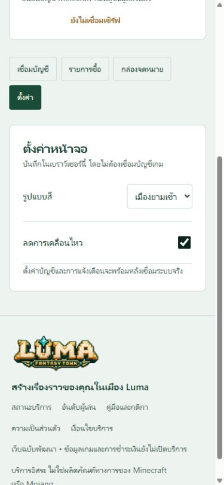

# ผลตรวจเว็บต้นแบบ Luma

5 ตุลาคม 2026 ตรวจผ่านเบราว์เซอร์ของ Codex กับ local preview

หลังเปลี่ยน stack: Next.js production build ผ่าน, Node/API + PostgreSQL tests ผ่าน 6 รายการ ไม่ skip
PostgreSQL local container healthy, migration สำเร็จ และหน้า `/status/` แสดงเชื่อมฐานข้อมูลแล้วจาก SELECT 1 จริง
React navigation ไป `/map/` ได้ หมุดธนาคารและตัวกรองแสดงพิกัดถูกต้อง
ตรวจ React รุ่นล่าสุดซ้ำที่ 1280 × 720 และ 390 × 844: ไม่มีภาพเสียหรือหน้าล้นแนวนอน
เมนูมือถือเปิด/ปิดได้ คู่มือซ่อมพาไปโรงตีเหล็กรูน และค้นหา Halo เปิดรายละเอียดสินค้าได้
หน้า setting เปลี่ยนธีมสว่างและลดการเคลื่อนไหวได้ ตรวจค่า DOM ตรงกับตัวเลือก แล้วคืนธีมมืด/การเคลื่อนไหวปกติ
ไม่มี console warning/error ระหว่างขั้นตอนที่ตรวจ ยังไม่ได้วัด FPS หรือ load test หลายผู้ใช้
ภาพทั้งหมดด้านล่างเป็น React รุ่นล่าสุด ผลแบบ HTML ช่วงแรกเก็บไว้เป็นประวัติตรวจงาน

Hosted frontend เผยแพร่สำเร็จ: [Luma Fantasy Town](https://luma-fantasy-town.tunarmzofficial.chatgpt.site)
เป็น owner-private preview; Node API และ PostgreSQL ยังรันในเครื่อง ไม่ใช่ backend ที่ deploy ออนไลน์แล้ว

| รายการ | ผล |
|---|---|
| หน้าคอมพิวเตอร์ 1280 × 720 (React ล่าสุด) | แสดงโลโก้ เมืองสีเต็ม ทางลัดระบบ ไม่ล้นแนวนอน |
| หน้ามือถือ 390 × 844 | ตัวอักษร/ปุ่มอ่านได้ ไม่ล้นแนวนอน เมนูเปิดได้ |
| ค้นหาธนาคาร + กรองประเภท | พบ 1 สถานที่ และมีข้อความเมื่อเงื่อนไขไม่พบข้อมูล |
| หมุดธนาคารและรายการบริการ | เลือกแล้วแสดงพิกัด -72, -19 ถูกกับแผน |
| คู่มือซ่อม → โซนบริการ | ไปโรงตีเหล็กรูน X70, Z32 |
| ค้นหาทั้งเว็บ → Halo | เปิดหน้าร้านและรายละเอียดสินค้าได้ |
| ชำระเงินจริง | ปุ่มปิดตามสถานะยังไม่เชื่อม |
| ตรวจรหัส /link | บอกชัดว่ารหัสไม่ได้ถูกส่งหรือตรวจ ไม่มีผลยืนยันปลอม |
| แท็บรายการซื้อ / ตั้งค่า | เปลี่ยนแผงได้ ไม่มีข้อมูลคำสั่งซื้อปลอม |
| ธีมกลางวันและลดการเคลื่อนไหว | เปลี่ยนค่าและแสดงสถานะตรงกัน |

พบและแก้บั๊ก CSS `button:active` ทำให้หมุดที่จัดกึ่งกลางด้วย transform กระโดดเมื่อกด จึงไม่เกิด click
แก้ให้หมุดรักษา transform เดิม แล้วกดหมุดธนาคารตรวจรายละเอียดใหม่สำเร็จ

ผลนี้ไม่ใช่การทดสอบ Minecraft runtime, payment provider, การส่งของจริง หรือประสิทธิภาพผู้เล่นจำนวนมาก
syntax checks และการตรวจไฟล์อ้างอิงทำแยกในเครื่องก่อนจัดเก็บงาน
