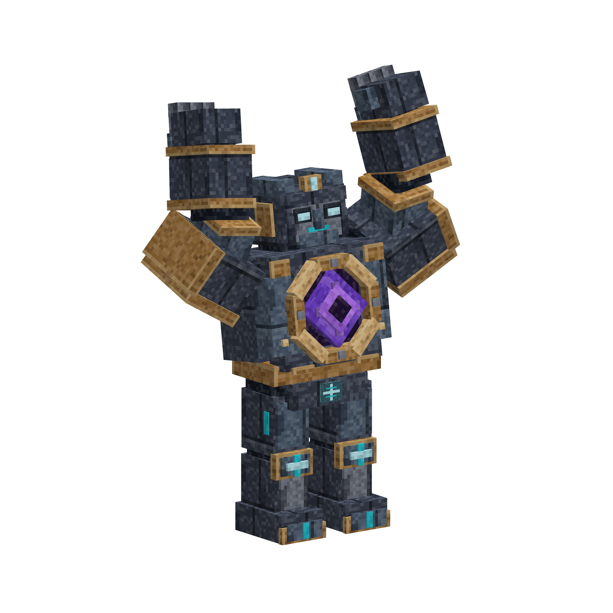
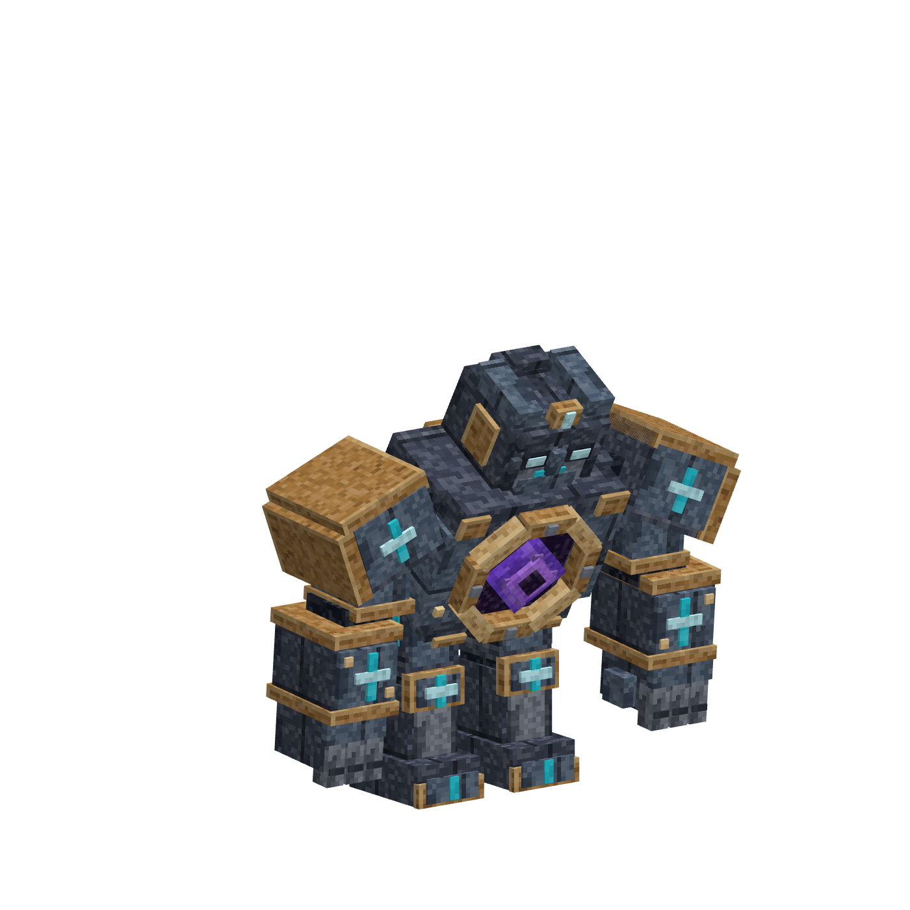

# ผู้พิทักษ์จันทร์แตก — โมเดลบอส Moonfall v1

อัปเดต 5 ตุลาคม 2026: สร้าง/ลงสี/rig/animation/export ผ่าน **Blockbench MCP ในเครื่องจริง**
ภาพ turnaround สร้างด้วย imagegen โดยอ้างอิง [ลานบอสเดิม](../../../../output/lobby-concept/dungeons/moonfall/04-boss-arena.png)
มี 146 cubes (145ชิ้นแสดงผล + collision proxy1), 19 bones, atlas128×128, 8 animations/150 keyframes
ตรวจ native timeline29เฟรมและไฟล์/UUID/UV/hashผ่าน; **ยังไม่ import ModelEngine หรือทดสอบ Minecraft**
Coreยังเป็น v0.8/schema7 และใช้ Husk native บอสในเกม; รอบนี้ไม่เปลี่ยนค่าHP/รางวัลหรือเปิดรับผู้เล่น

## ภาพและไฟล์จริง


- [ไฟล์แก้ไข .bbmodel](../../../../output/lobby-concept/assets/models/boss_moonfall_guardian_v1.bbmodel)
- [PNG texture atlas](../../../../output/lobby-concept/assets/models/boss_moonfall_guardian_v1.png)
- [ด้านหน้า](../../../../output/lobby-concept/assets/models/boss_moonfall_guardian_v1-front.png) · [ด้านข้าง](../../../../output/lobby-concept/assets/models/boss_moonfall_guardian_v1-right.png) · [ด้านหลัง](../../../../output/lobby-concept/assets/models/boss_moonfall_guardian_v1-back.png)
- [manifest/ที่มา/hash](../../../../output/lobby-concept/assets/models/boss_moonfall_guardian_v1-manifest.json) · [native pose bounds](../../../../output/lobby-concept/assets/models/boss_moonfall_guardian_v1-pose-checks.json)
- [ข้อตกลงเชื่อม Core ↔ renderer](model-contract.json) — เป็น specification ที่ disabled ไม่ใช่ config ของ ModelEngine พร้อมรัน

Generic .bbmodel มี embedded texture และ animation จริง ไม่ต้องหาtextureนอกrepoเพื่อเปิดใน Blockbench
native export รอบนี้เป็น **format_version5.0** (groupsแยกจากoutliner); importerรุ่นที่จะใช้ต้องอ่านได้จริงก่อนติดตั้ง
MCP session tunnelตอบ429 แต่ local HTTP MCPที่ตั้งไว้ตอบได้; ไม่เปลี่ยนconfig/เปิดportเพิ่ม
สร้างprojectใหม่ เก็บ NPC/itemต้นฉบับ6ชุดไว้; ไม่มีการแก้โมเดลบุคคลอื่นหรือแอบนำassetที่ซื้อมาเผยแพร่

## ลงสีและรายละเอียด

หินน้ำเงินเทาเข้มใช้หลายระดับสี มีpixelชิ้นหิน รอยต่อและรอยร้าว; ขอบplateใช้หินอ่อนกว่า
ทองแดงเก่ามีhighlightขอบบน เงาขอบล่างและรอยถลอก แยกจากรอยดำที่ข้อต่อ
รูนฟ้าอยู่คิ้ว/ตา/ไหล่/ข้อมือ/เข่า/รองเท้า ใช้สีสว่างและเส้นตัดให้เห็นกลางดันมืด
แกนสีม่วงซ้อนชั้น crystal/void/facet ในช่องอกลึก กรอบทองแดง8ส่วนและหมุดยึด4จุด
แผ่นหลังมีตราจันทร์ทองบนม่วง ใช้UVtileเฉพาะ ไม่ต้องสร้างตัวอักษรเป็นหลายสิบbones
นิ้ว3ส่วนต่อมือ แยกข้อนิ้วและนิ้วโป้ง; ช่องศอก/ข้อมือ/เข่า/ข้อเท้าอ่านรูปทรงได้เมื่อขยับ
ใช้cuboid/rotationที่เหมาะกับMinecraft ความละเอียดมาจากรูปทรงที่สำคัญกับUV ไม่เพิ่มmesh/subdivision
สีสว่างในeditorยังไม่ใช่หลักฐานว่าglow/emissiveในเกมทำงาน; bloom/outlineเป็นงานrendererprofileต่อไป
ภาพAIละเอียดกว่าเกมโมเดลจริง ใช้เป็นทิศทางออกแบบ ไฟล์nativeและviewportเป็นหลักฐานสิ่งที่สร้างแล้ว

## Rig ขนาดและการวาง

North/−Zเป็นหน้าตัว เท้าY0, 16units/block ตาม [คู่มือผู้พัฒนา ModelEngine](https://wiki.mythiccraft.io/modelengine/Modeling/Creating-a-Model)
motion_root → hips → body → hi_head/core/backplate/upper_arm → forearm → hand; thigh → shin → foot แยกซ้ายขวา
pivotอยู่ไหล่ ศอก ข้อมือ สะโพก เข่าและข้อเท้า; plateไหล่เป็นลูกupper_arm ไม่ลอยตอนทุบ
ไม่animatehitbox; มี collision proxyเสนอกว้าง24×24units สูง54units (1.5×1.5×3.375blocks), eye48units/3blocks
hitboxซ่อนในeditorแต่exportอยู่ ต้องตรวจว่าimporterอ่านspecialboneนี้จริง; ยังไม่มีผลcollisionในเกม

neutralสูง3.375blocks; nativeเฟรมที่ตรวจสูงสุดประมาณ4.237blocksตอนยกแขน, กว้างสุดประมาณ4.011blocks
ตัวเลขนี้รวมvisualarm/pose ไม่ใช่collisionwidth และไม่ใช่proofว่าไม่ชนทุกจุดระหว่างinterpolation
ต้องเว้นพื้นที่แสดงผลอย่างน้อย5×5blocks/ช่องหัว5blocks และทดสอบลาน/เสา/ประตู/tetherทุกท่าจริง
จุดspawnบอส Coreปัจจุบัน (116.5,20,118.5), yaw180มองNorthเข้าผู้เล่นที่เข้าใต้ลาน
landingตรวจHuskขนาดปกติยังไม่พอสำหรับhitboxใหม่: adapterต้องตรวจfootprint/หัวตามขนาดจริงก่อนattach
ไม่วาง serviceNPCในโลกดัน และไม่ให้สองproviderสร้างcombatentityซ้อนกัน

## Animation และภาพกำกับ

| State | ระยะเวลา | Loop/Override | ใช้อย่างไร |
|---|---:|---|---|
| idle | 4s | loop / false | bodyหายใจเบา coreเต้น ไม่มีfoot slide |
| walk | 1.6s | loop / false | แขน/ขาคนละข้างเป็นจังหวะ rootไม่เคลื่อนXZ; pathfindingเป็นของCore |
| spawn | 2s | once / true | เงยหน้าและแกนขยายกลับขนาดปกติ |
| attack | 0.9s | once / true | เหวี่ยงแขนขวาและบิดอก เป็นภาพประกอบ melee |
| slam | 2.2s | once / true | ยกสองแขน ค้างwindup กระแทกที่1.25s แล้วกลับneutral |
| enrage | 1.6s | once / true | ขยายcore/กางแขน เสนอเรียกครั้งเดียวเมื่อHPต่ำกว่าครึ่ง |
| hurt | 0.5s | once / true | สะดุ้งสั้น ไม่ควรขัดจังหวะslam |
| death | 2s | hold / true | ก้มล้ม/แกนดับ ถือposeสุดท้ายจนrendererถูกถอด |

snapping20FPS ทุกkeyอยู่บนstep0.05s; idle/walkต้นท้ายต่อกัน ตรวจchannel/UUIDและnohitboxkeyframeแล้ว
state/default/loop/overrideและการอ่านanimationอ้างอิง [คู่มือ ModelEngine](https://wiki.mythiccraft.io/modelengine/Modeling/Animating-a-Model)
ไม่ได้รับประกันFPS/clientinterpolationหรือMSPTจากจำนวนkeyframes; ต้องวัดในเกมจริง




ภาพwindupคือ1.10s; impactคือ1.25s = **25ticks** ตรงเวลาสกิลCorev0.8
แก้ทิศลำตัวให้โน้มหน้าเมื่อกระแทกจากผลviewportreviewแล้ว ท่าจบคืนneutral
[เดิน](../../../../output/lobby-concept/assets/models/boss_moonfall_guardian_v1-walk.png) · [เกิด](../../../../output/lobby-concept/assets/models/boss_moonfall_guardian_v1-spawn.png) · [โจมตี](../../../../output/lobby-concept/assets/models/boss_moonfall_guardian_v1-attack.png) · [คลั่ง](../../../../output/lobby-concept/assets/models/boss_moonfall_guardian_v1-enrage.png) · [ตาย](../../../../output/lobby-concept/assets/models/boss_moonfall_guardian_v1-death.png)

## เชื่อมกับ Core โดยไม่เพิ่มบัค/lootซ้ำ

model-contract.jsonกำหนดงานadapterที่ต้องเขียนจริงภายหลัง ไม่ใช่คำสั่งconsoleพร้อมใช้
Coreยังเป็นผู้สร้างmob/runID/target/HP/damage/telegraph/completion/mail/cleanupเพียงผู้เดียว
renderer attachหลังspawnตรวจผ่าน และเรียกstateตามเหตุการณ์Core; ห้ามkeyframe/scriptสร้างdamageหรือloot
time0แสดงวงเตือน; tick25Coreตรวจtarget/radius/LOSและdamage อิสระจากasset
หากlag/packdecline/หยุดanimation gameplayยังใช้เวลาสกิลserverและวงเตือนที่อ่านได้
หยุดทุบเมื่อสมาชิกหลุด: cancelCoretask+วง, pause/stopvisualtimeline; resumeเริ่มidleและรอ4sก่อนslamใหม่
ไม่resumeจากเฟรม1.20แล้วตีทันทีหลังคนกลับ; restartไม่ต่อcombat ตาม [กติกา Party](../../../../fantasycore/PARTY-DUNGEONS-th.md)

melee/enrage/hurtเป็นภาพ feedback ไม่เปลี่ยนสูตร HP/attack ปัจจุบัน; enrageเป็นone-shotต่อrun
ตายให้Corecommitรางวัลตามกติกาเดิม corpseถ้าต้องแสดง2sเป็นvisualอย่างเดียว แยกcleanupโดยไม่มีdrops/damage/runใหม่
abort/timeout/worldunload/disable/slotreuse ต้องstopstate+ถอดmodel+ล้างvisualentities โดยไม่โดนทีมโลกอื่น
legacy/modernpackต้องcompileหลังเลือกJARที่มีสิทธิ์ใช้และตรวจAPIจริง; ไม่อ้างว่าViaแปลงทุกmodelให้เอง
ยังไม่พบ ModelEngine/MythicMobs JARในส่วนเซิร์ฟที่ตรวจ จึงไม่ทดลองติดตั้ง/ซื้อหรือเดาadapterAPI

## เปิดดูและตรวจซ้ำ

เปิด .bbmodel ใน Blockbench → Animate → เลือกstateแล้วPlay; ดูtextureและbonesในEdit
MCPใช้ localhost:3000/bb-mcp ที่ตั้งไว้เดิม; ไม่ต้องส่งไฟล์modelให้Antigravityagent ถ้าใช้MCPตรงเช่นรอบนี้
ถ้าให้Antigravitypolishต่อ ใช้ [ใบงาน](../../../../output/lobby-concept/ANTIGRAVITY-BLOCKBENCH-HANDOFF-th.md) และส่งออกrevisionใหม่

```powershell
python tools/verify_moonfall_model.py
python tools/verify_luma_artifacts.py
python tools/build_moonfall_boss.py --dry-run
```

builderจะปฏิเสธprojectไม่ตรงUUID/ชื่อ, projectไม่ว่าง หรือไฟล์revisionมีอยู่แล้ว; ไม่รันทับงานเก่า
previewscriptต้องระบุUUIDprojectนี้และเขียนภาพreviewของdraftที่เป็นของงานนี้
MCP1.10.0มีerror onContextMenuหลังdisposeoffscreenview จึงตรวจlist_viewsว่าถูกถอดจริง ไม่กลืนerrorอื่น
ไฟล์source/tests/manifestไม่มีข้อมูลcredentialหรือโมดูลซื้อจาก All for module

## Checklist สำหรับ production

- [x] AIreferenceเก็บในrepo; โมเดลลงสี/UV/rig/8animationsจริง; exportnativeมีembeddedtexture
- [x] 146cubes/19bones/150keys; parenting/UUID/per-faceUV/rotationlimit/loopclosure/hashผ่านofflinegate
- [x] native29เฟรมผ่าน bounds และviewportreview; forwardslam/neutral/endposeไม่ผิดทิศ; previewเห็นครบตัว
- [ ] exactModelEngineJAR/API/license/Paper26.2/format5importและshaderprofileผ่าน
- [ ] collider/eyeheight/attackreach/footprint/pathfinding/ประตู/ceiling/intermediateposesไม่มีclippingจริง
- [ ] statehookจริง+ทุบ25ticks+pause/reconnect4s+death/abort/cleanupทั้ง3slotsผ่าน
- [ ] client1.16.5/รุ่นกลาง/26.2 ทั้งรับ/ปฏิเสธpackเห็นtelegraph ถูกtexture/hitbox/HPbar
- [ ] benchmarkentities/MSPT/framepacing และ [checklist R/S](../../../README-th.md) ผ่านก่อนเปิด

NPCบริการ4ตัวและitem2ชิ้นเดิมยังเป็นpilot; งานpolishสี/เกราะ/ผ้า/propsให้ละเอียดแบบนี้ต้องทำrevisionv2ตามลำดับ
ไม่เปลี่ยนภาพร้าน/สถานะสินค้าบนเว็บให้ดูเหมือนmodelproductionก่อนผ่านruntimegate
