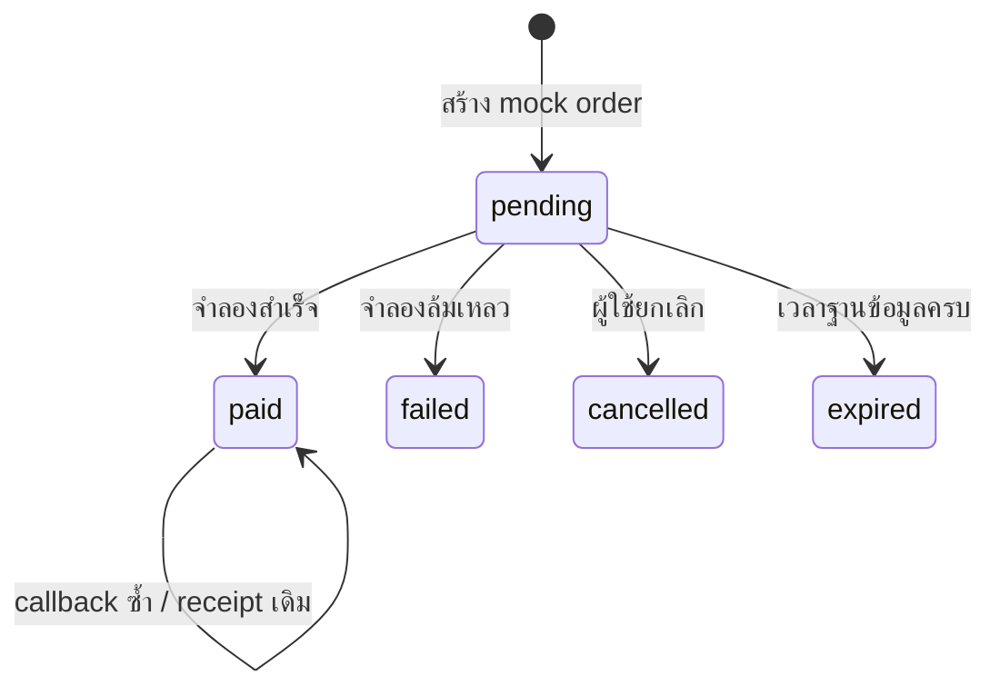

# PromptPay DEV และแผนเชื่อม gateway ของ Luma

**ใช้ได้ตอนนี้:** หน้าร้าน 22 ชุด, ค้นหา/กรอง, รายละเอียดสินค้า, สร้าง order จำลอง, เลือกผลสำเร็จ/ล้มเหลว/ยกเลิก, หมดเวลา และใบรับสิทธิ์จำลองใน PostgreSQL
**ยังไม่ใช้เงินจริง:** ไม่มี gateway keys, ไม่มี QR ที่สแกนจ่ายได้, ไม่มีบัญชีเกมที่ผูก UUID แล้ว และยังไม่มี game delivery bridge
คำว่า paid ใน `dev_payment_orders` คือ state จำลองเท่านั้น ไม่ใช่ยอดรับเงินจริง

## 1. ทดลองในเครื่อง

แก้ `website/.env.local` โดยเก็บ DATABASE_URL เดิม:

```dotenv
HOST=127.0.0.1
PORT=4178
LUMA_PAYMENT_MODE=mock
```

```powershell
cd website
npm run db:migrate
npm test
npm run build
npm start
```

เปิด `/shop/` → เลือกชุด → **ทดลองซื้อด้วย PromptPay** → **จำลองชำระสำเร็จ**
หน้ารายการแสดงจำนวนเงินบาท เลข order และวันหมดเวลา 10 นาที; ส่วนภาพ DEV เป็น placeholder ที่สแกนไม่ได้
สำเร็จแล้วแสดงกล่องจดหมายจำลอง 1 entitlement ไม่มีคำสั่งไปยังเซิร์ฟ Minecraft
ปิดรายละเอียด/รีโหลดเว็บแล้วเปิดสินค้านั้นใหม่ จะอ่าน last order จาก localStorage และตรวจเจ้าของจาก cookie เดิม
ปิดโหมดด้วย `LUMA_PAYMENT_MODE=disabled` แล้วรีสตาร์ต Node; ค่าเริ่มต้นของ `.env.example` คือ disabled

`npm run dev` ของ Next ที่ 4179 เป็น frontend แยก; simulator ออกแบบสำหรับ Node same-origin ที่ 4178 ใช้ `npm start` ในการทดสอบซื้อ
ไม่เปิด mock ผ่าน reverse proxy หรือ bind `0.0.0.0`; process จะไม่เริ่มถ้าค่าขัดกับ local-only หรือ NODE_ENV=production

## 2. เส้นทางและ state จริงของ simulator

| Endpoint | การทำงาน |
|---|---|
| GET `/api/library/catalog` | แคตตาล็อก draft จากไฟล์ Luma ไม่ใช่สินค้าที่เปิดรับเงินจริง |
| GET `/api/dev/status` | บอกว่า mock เปิดหรือปิด ไม่มีบัญชี/ยอดเงิน |
| POST `/api/dev/session` | สร้าง cookie HttpOnly, SameSite=Strict, อายุ 24 ชม. เก็บ token hash |
| POST `/api/dev/checkout` | รับ product ID + UUID idempotency key; ราคาและ snapshot มาจาก server |
| GET `/api/dev/orders/:id` | อ่านได้เฉพาะ session ของเจ้าของ; ตรวจเวลาจาก PostgreSQL |
| POST `/api/dev/orders/:id/outcome` | เลือก paid/failed/cancelled เมื่อ pending |

ทุก POST ต้อง JSON, `X-Luma-Dev: 1`, Origin ตรง Host และ connection เป็น loopback
ตรวจ Host อีกครั้งเพื่อไม่เปิด simulator ด้วยชื่อเว็บภายนอกที่ DNS ชี้ localhost
body จำกัด 4KB, pending สูงสุด 20 รายการที่ยังไม่หมดเวลาต่อ session
ไม่มี user name/UUID ที่พิมพ์เองถูกนำไปส่งของให้คนอื่น



state terminal ไม่ย้อนเป็น paid จาก failed/cancelled/expired
ล็อก session row และ order row ใน transaction; paid + receipt ถูก commit พร้อมกัน
ตาราง `dev_payment_receipts` มี order_id เป็น PRIMARY KEY จึงสร้างสิทธิ์จำลองซ้ำไม่ได้เมื่อกดพร้อมกัน
แยก `dev_*` จาก `orders`, `payment_events`, `delivery_outbox`, players และ Minecraft mailbox จริง
transaction ที่ผิดพลาด rollback; ผู้ใช้กด retry ด้วย idempotency key เดิมจะไม่สร้างรายการเดิมซ้ำ
การลบ cookie หมายถึงเข้าถึงรายการเดิมไม่ได้; DEV ไม่ใช้แทนระบบ authentication production

## 3. หลักฐานทดสอบ

`npm test` ผ่าน 15 tests/subtests กับ PostgreSQL ในเครื่อง โดยไม่มี skipped:

- ราคา client ส่ง 1 สตางค์และ quantity 99 ถูกละไว้ simulator สร้างสิทธิ์ 1 ชุดตามราคา server
- สร้าง order พร้อมกัน 8 ครั้งด้วย key เดียว ได้ order ID เดียว
- ส่งผล paid พร้อมกัน 8 ครั้ง ได้ receipt แถวเดียว
- session อื่นอ่าน/เปลี่ยน order ไม่ได้, Origin ภายนอกถูกปฏิเสธ และ Host ภายนอกทำให้ DEV ปิด
- เปิดรายละเอียดสินค้าอื่นใช้ cookie/session เดิม จึงไม่ทำให้เข้าถึงรายการก่อนหน้าหาย
- failed/cancelled/expired ไม่กลับไป paid และไม่เกิด receipt
- Node ปิดแล้วเริ่มใหม่อ่าน order/receipt เดิมได้
- NODE_ENV=production ปิด endpoint mock
- จำนวน live orders และ real delivery_outbox ไม่เปลี่ยนจากการทดสอบ mock

ตรวจ UI จริงบนจอ 390 พิกเซลและขนาดหน้าต่างปกติแล้ว: ค้นหา/กรอง เปิดรายละเอียด สร้าง order และรับ receipt ทำงาน ไม่พบภาพเสีย/ล้นแนวนอนในหน้าที่ตรวจ
ภาพ [หน้าร้าน](../output/lobby-concept/luma-library-shop.jpg), [DEV](../output/lobby-concept/luma-promptpay-dev.jpg), [มือถือ](../output/lobby-concept/luma-library-mobile.jpg)

## 4. Gateway ที่เสนอให้เริ่มทดสอบ

เสนอ Omise/Opn เป็น candidate เพราะมี PromptPay source/charge, QR image และ `charge.complete` webhook; หลังรับ event ให้ retrieve charge เพื่อตรวจสถานะจริงก่อนออกสิทธิ์ ([PromptPay official](https://docs.omise.co/promptpay))
นี่เป็นข้อเสนอ ยังไม่มีบัญชีร้านค้าหรือสัญญา gateway ที่ทำแทนผู้ใช้ และยังไม่มี Omise client ใน runtime ของเว็บ
merchant ต้องเปิดบริการ PromptPay และนำ test secret/public key + webhook secret เข้า secret manager ของ host; ไม่ส่ง key ในแชตและไม่ตั้ง `NEXT_PUBLIC_*` สำหรับ secret

ขั้น implement live ที่ต้องทำก่อนปล่อยจริง:

1. ผู้เล่น login แล้วใช้ code อายุสั้นยืนยันจากภายในเกม ผูก UUID จริงกับ web session; ไม่เชื่อชื่อเกมที่กรอกเอง
2. checkout เลือก SKU active ที่มี fulfillment factory ผ่านแล้ว, freeze catalog version, จำนวน, ราคาเป็นสตางค์ และสิทธิ์ใน transaction
3. สร้าง PromptPay charge server-side ด้วย secret key, currency THB, amount จาก order และ metadata ที่ชี้ order ID
4. เก็บ provider charge ID แบบ unique ก่อนให้ QR URL แก่ผู้ใช้; timeout ที่ไม่รู้ว่าถูกสร้างแล้วหรือไม่ต้อง reconcile ไม่สร้างใหม่ซ้ำสุ่ม
5. webhook รับ raw bytes, ตรวจ HMAC-SHA256 จาก `Omise-Signature` และ timestamp ก่อน parse; secret decode Base64, signed data คือ timestamp + `.` + raw body; เปรียบเทียบ constant-time รองรับ signature สองค่าเมื่อ rotate ([Webhook official](https://docs.omise.co/api-webhooks))
6. ใช้ replay window 5 นาทีตาม policy ของ Luma และ event ID unique; ดึง charge ด้วย server key ตรวจ amount/currency/order reference/livemode/status ที่ตรงกับ order
7. successful เท่านั้นทำ paid+outbox+audit ใน transaction เดียว; failed/pending/mismatched amount ไม่ออกของ และ mismatch เข้า review
8. game worker อ่าน outbox ผ่านบริการภายในที่ authenticate; ใช้ operation ID เดิมเพื่อ grant entitlement/mailbox ให้ UUID ที่ผูกไว้
9. game ack หลัง transaction ของ Core ยืนยันแล้ว; network หาย retry ที่ operation เดิม ไม่ใช้ RCON give แล้วค่อยทำเครื่องหมายจากเว็บ
10. ออฟไลน์/กระเป๋าเต็มรับผ่าน mailbox; provider ไม่พร้อมค้าง pending/review แบบมีเหตุผล ไม่แปลงเป็น vanilla ที่ไม่มี model แล้วอ้างว่าส่งครบ
11. ติดตั้ง HTTPS, real web session/CSRF, rate limits, audit/admin permissions, receipt page และ monitoring; mock ไม่ได้ทดแทนข้อเหล่านี้
12. ทดสอบ provider test mode และ game staging ครบก่อนสลับ live secret; ทดสอบรายการจริงเล็กหนึ่งรายการเมื่อเจ้าของ merchant พร้อมยืนยัน

ห้ามใช้ callback ของ browser, รูปสลิป หรือปุ่ม “จ่ายแล้ว” เป็นหลักฐาน paid
PromptPay ของ Omise ระบุไม่รองรับ void/refund ผ่าน API แบบนี้; วาง support workflow สำหรับคืนเงินโดยทีมงานพร้อมหลักฐานและ audit แยก ห้ามทำปุ่มคืนเงินที่แสร้งส่ง API สำเร็จ ([PromptPay official](https://docs.omise.co/promptpay))

## 5. Product และ game contract

ร้าน draft ให้ `fulfillment.kind=cosmetic-entitlement`, setId, version และ `combatStats=false`
ก่อนเปิดขายต้องกำหนดรายการ component ที่คนใช้ได้จริงของแต่ละชุด; ไม่รวมโมเดล helper หรือ source assets
เงินซื้อสิทธิ์ appearance/ของตกแต่ง; enchant และทักษะ gameplay ได้จาก [เส้นทางเควส/สร้างในเกม](../server/content/library/BALANCE-th.md)
ข้อมูลใน payment webhook ไม่สามารถสั่ง console command จาก client ได้
หลังยืนยัน paid เก็บ entitlement ที่ซื้อเป็น versioned snapshot; ไม่ใช้ config ล่าสุดแทนสินค้าที่ผู้เล่นจ่ายแล้วโดยไม่มี migration

Core game bridge ยังไม่ implement: ต้องรับ operation ID, recipient UUID, frozen entitlement และบันทึก applied operation แบบ unique พร้อม mailbox
ตอนนี้ outbox production มี schema อยู่ แต่ยังไม่มี worker/ack ส่วนเกม; ไม่มีการรับเงินจริงจนจุดนี้ใช้งานและผ่าน recovery test
ทั้งการ restore DB เว็บและ DB เกมต้องมี reconciliation; คำว่า exactly-once ต้องอ้างเฉพาะ transaction ที่พิสูจน์ ไม่ครอบคลุมการ restore ที่ไม่ตรงกัน

## 6. Acceptance ก่อนเปลี่ยนสถานะเป็น live

แคตตาล็อกต้องมี active SKU/ราคา/รายการของชัด, authentication ผูก UUID, test gateway และ webhook ผ่าน, game delivery/fallback ผ่าน, admin review ใช้งานได้
ต้องมีหลักฐาน duplicate/reorder/timeout/restart/full inventory/offline/refund workflow และไม่มี test order ถูกอ่านเป็นยอดจริง
จนกว่าจะครบ หน้า live checkout และ webhook เดิมตอบ `INTEGRATION_UNCONFIGURED`; DEV ใช้ namespace แยกและปิดโดย default
